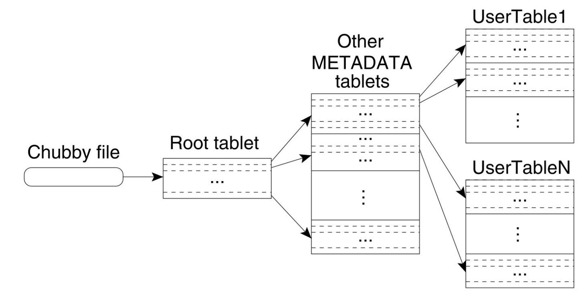

Bigtable“用于解决 Google 内部不同产品在对数据存储的容量和响应时延需求的差异化，力求在确保能够容纳大量数据的同时减少数据的查询耗时”。

    
说到底就是一个数据库。

值得注意的是，虽然Bigtable不支持SQL，但是仍然借来了一些SQL中的一些概念（表、行、列）。

<h2 id="前置知识">前置知识</h2><h3 id="Chubby-分布式锁服务1">Chubby 分布式锁服务<a href="#fn_1" id="reffn_1">1</a></h3>
Chubby是一个“分布式锁服务”，其底层实现是paxos，作用是提供一个分布式系统中的锁。

锁的形式类似一个文件，即创建一个文件相当于加锁，删除一个文件相当于解锁。

<h3 id="SSTable文件格式">SSTable文件格式</h3>

就是这样一个简单的文件形式，把一堆key-value<strong>排好序</strong>放在一个文件里就成。

在使用的时候，这个结构可以在内存中，也可以被放入外存中。

可以看到，这种结构对查询比较友好，对更新则不够友好，而对外存中的更新更加不友好。

<h2 id="数据模型">数据模型</h2>
Bigtable把数据存储在若干个 Table 中，这里的table可以类比数据库的表，只不过：

<ol>
<li>Bigtable中的行名列名都是字符串</li>
<li>Bigtable里的每个值都关联了一个时间戳，要找到一个值不仅要提供行名和列名，还要提供这个时间戳</li>
</ol>

Bigtable 在存储数据时会按照 Row Key 对 Table 进行字典排序，并把一个 Table 按 Row 切分成若干个相邻的 Tablet，并将 Tablet 分配到不同的 Tablet Server 上存储。

<h2 id="系统原理">系统原理</h2><h3 id="节点">节点</h3>
一个Bigtable系统中的节点分为两类：

<ul>
<li>
Master

Master 负责检测集群中的 Tablet Server 组成以及它们的加入和退出事件，会将 Tablet 分配至 Tablet Server，并负责均衡 Tablet Server 间的存储负载以及从 GFS 上回收无用的文件。

</li>
<li>
Tablet Server

管理若干个由 Master 指定的 Tablet，负责处理针对这些 Tablet 的读写请求，并负责在 Tablet 变得过大时对其进行切分。

</li>
</ul>
<h3 id="定位数据">定位数据</h3>
Bigtable 的 Tablet 之间会形成一个三层结构，具体如下：

<ol>
<li>在 Chubby 中的一个 File 保存着 Root Tablet 的位置</li>
<li>Root Tablet 保存着 <code>METADATA</code> Table 所有 Tablet 的位置</li>
<li><code>METADATA</code> Table 中保存着其他所有 Table 的 Tablet 的位置</li>
</ol>

Tablet对应的文件存放在存储设备中的结构如下：

一个 Tablet 由若干个位于 GFS 上的 SSTable 文件、一个位于内存内的 MemTable 以及一份 Commit Log 组成。

<h3 id="读写过程">读写过程</h3>
读的时候就按照这个顺序，一个个的找过去。

写的时候，Bigtable 首先把此次变更记录到 Commit Log 中。而后，插入的数据会被放入到位于内存内的一个 MemTable 中，其中 MemTable 保持其内部的数据有序。而对于那些已经持久化的数据则会作为一个个 SSTable 文件保存在 GFS 中。

Memtable 与 SSTable 本身都采取了数据不可变的设计思路：更改操作产生的新条目以 Copy On Write 的方式放入到 MemTable 中，而删除操作只是向旧条目打上一个删除标记。

待 MemTable 内的条目数达到一定阈值后，会将旧的 MemTable 写入到新的 SSTable 文件中，并开启一个新MemTable，该操作被称为 Bigtable 的 Minor Compaction。

每一次 Minor Compaction 都会产生一个新的 SSTable 文件，而过多的 SSTable 文件会导致后续的读操作需要扫描更多的 SSTable 文件以获得最新的正确数据。为了限制 SSTable 文件数，Bigtable 会周期地进行 Merging Compaction，将若干个 SSTable 和 MemTable 中的数据原样地合并成一个 SSTable。

Bigtable 还会周期地执行一种被称为 Major Compaction 的特殊 Merging Compaction 操作：在这个过程中，Bigtable 除了会将若干个 SSTable 合并为一个 SSTable，同时将 SSTable 中那些应后续变更或删除操作而被标记为无效的条目移除。

这种存储方式实际上是一种 LSM Tree。

这种存储方式可以将对磁盘的随机写转换为顺序写，代价则是读取性能的下降。<a href="#fn_2" id="reffn_2">2</a>

为了解决读取性能的问题，Bigtable使用了读缓存和Bloom Filter方案。

<h4 id="读缓存">读缓存</h4><ul>

<li>Block Cache 会缓存从 GFS 中读出的 SSTable 文件 Block，提高客户端读取某个数据附近的其他数据的效率；</li>
<li>Scan Cache 缓存由 SSTable 返回给 Tablet Server 的键值对，以提高客户端重复读取相同数据的效率。</li>
</ul>
<h4 id="Bloom-Filter">Bloom Filter</h4>
布隆过滤器用于快速判断某个元素是否有可能在集合中。

某个key加入集合时，用k个hash函数计算出k个散列值，并把数组中对应的比特位置为1。

判断某个key是否在集合时，用k个hash函数计算出k个散列值，并查询数组中对应的比特位，如果所有的比特位都是1，认为元素可能在集合中，否则其一定不在集合中。

<blockquote id="fn_1">
1. 他不太有名，他的儿子zookeeper比较有名，他的孙子etcd可是大大的有名。<a href="#reffn_1" title="Jump back to footnote [1] in the text."> ↩</a>
</blockquote>
<blockquote id="fn_2">
2. 因为Bigtable 的文件实际上存储在 GFS 中，而 GFS 主要针对顺序写进行优化<a href="#reffn_2" title="Jump back to footnote [2] in the text."> ↩</a>
</blockquote>

