## 基本中的基本

先[下载](https://git-scm.com/downloads)，安装 Git。这一步我不讲，因为不同的环境遇到的问题肯定不一样，如果在这一步你遇到了问题请一对一询问本人[^1]。

然后用 `git init` 初始化你的仓库。

然后写点东西。

然后

```shell
git add -A
```

把所有的修改都添加到暂存区。

然后 commit 把暂存区里的修改提交到版本库

```shell
git commit -m "initial commit"
```

你会看到

```shell
[master (root-commit) f70b73f] initial commit
 1 file changed, 1 insertion(+)
 create mode 100644 1.txt
```

其中 `f70b73f` 这一段可以看作是你提交的这个版本的编号。

就把暂存区里的修改提交到版本库了。

再提交一个版本：

```shell
echo 2 > ./1.txt && git add -A && git commit -m "second commit"
```

```shell
[master d1b184d] second commit
 1 file changed, 1 insertion(+), 1 deletion(-)
```

我们可以用 `git log` 查看所有提交过的版本：

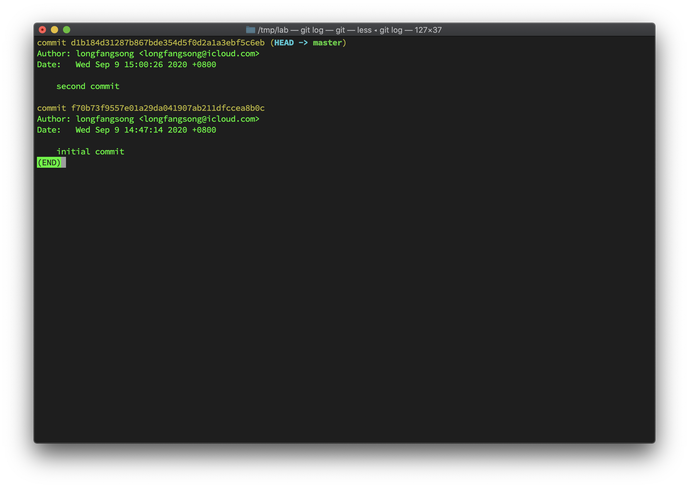

如果你要丢弃工作区目前的更改，恢复到版本库里的最后一个版本，使用 `git checkout`：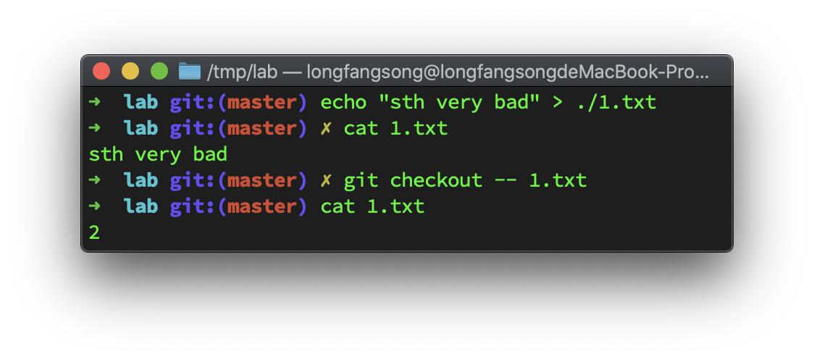

如果你已经把你的更改提交到暂存区了，那么要先用 `git reset HEAD` 把暂存区恢复到之前提交的状态，然后再`checkout`（当然这里直接`checkout HEAD .`也可）。

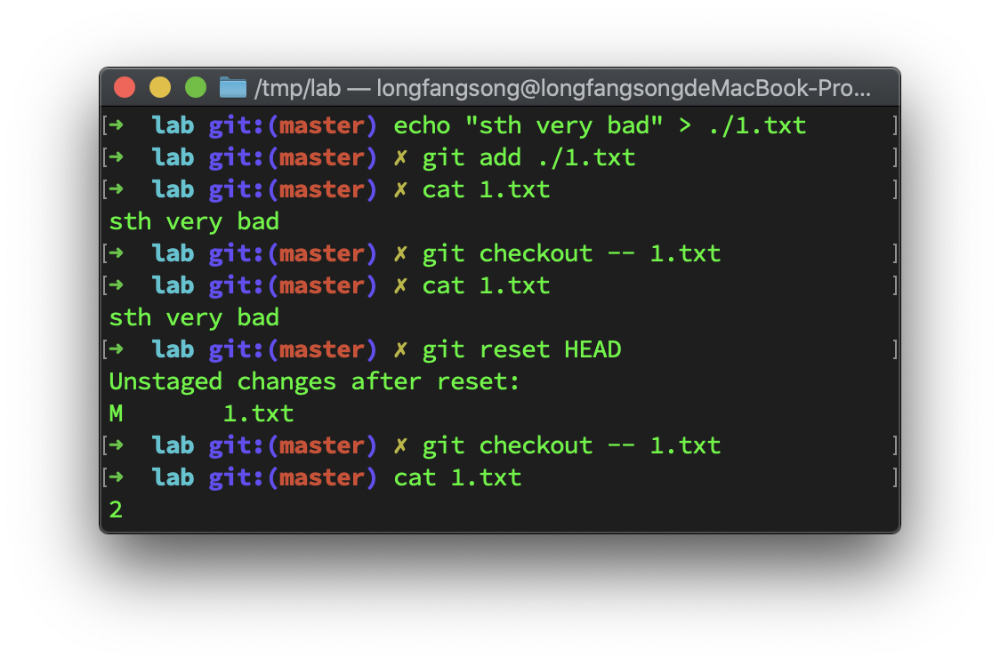

如果你已经提交了呢？


这时候就可以用  `git reset HEAD^` 把暂存区恢复到上一个提交的状态，然后再`checkout`。

同理 `HEAD^^` 就是上两个提交， `HEAD^^^` 就是上三个，那上100个肯定不能这么玩，要写成这样：`HEAD~100`，当然这里你直接写提交编号也可以。

## 远程合作

现在大部分开源软件的远程合作主要是通过 GitHub 进行的。

首先你要注册一个 GitHub 账号，这个只要点界面上的注册然后按照提示做就行了。

使用 GitHub 进行合作开发的主要流程如下：

### fork 仓库/创建新的仓库

如果你是准备参与别人的仓库的开发，那么一般情况下你没有对这个仓库进行操作的权限，你需要的是 fork 别人的仓库到自己的名下：

登录 GitHub，打开别人给你发的项目地址，点击 fork：

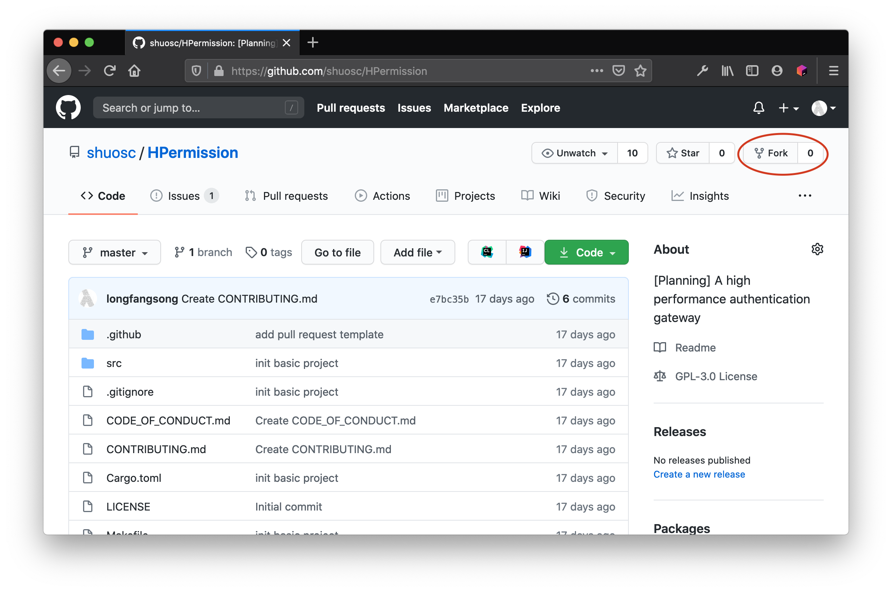

然后 GitHub 就会把这样一个仓库 fork 到你的名下。

如果你想自己开始一个项目，那么你应该新建一个项目：

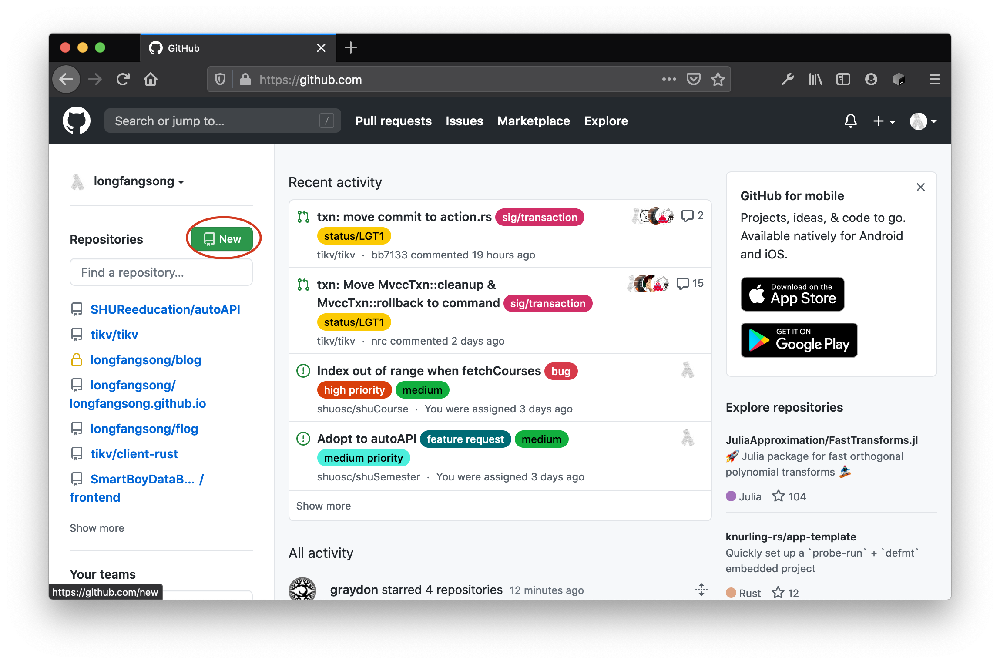

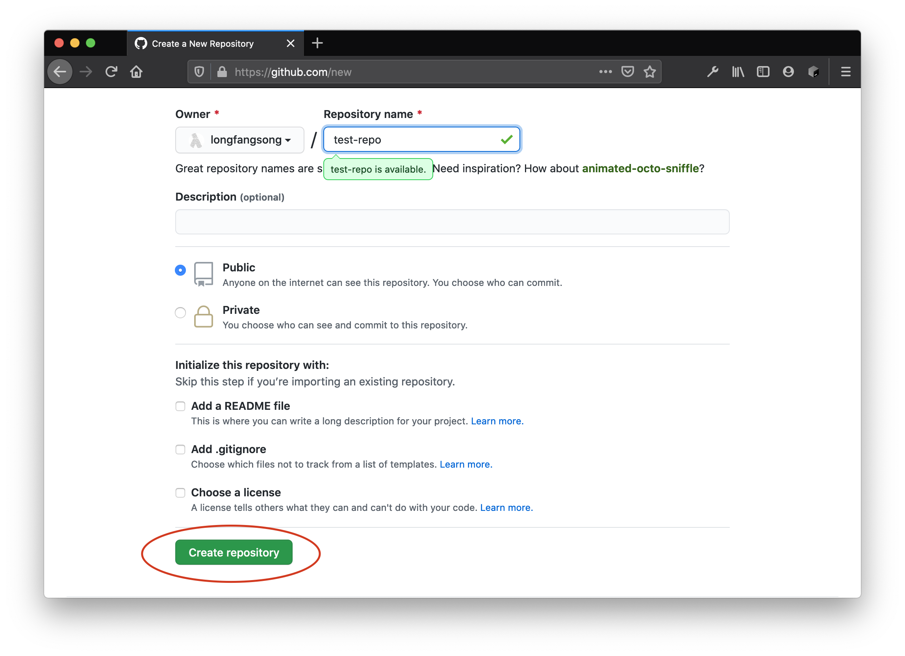

### 把仓库clone到本地

如果你的仓库是 fork 来的，说明这个仓库里已经有代码了，你需要把这个仓库clone到本地来进行修改。

使用 `git clone` 来把远程仓库 clone 下来：


### 使用 pull 和 push，让本地和远程互动

我们完成对代码修改，将修改添加到本地仓库之后，可以使用 `git push` 命令将代码上传到 GitHub：

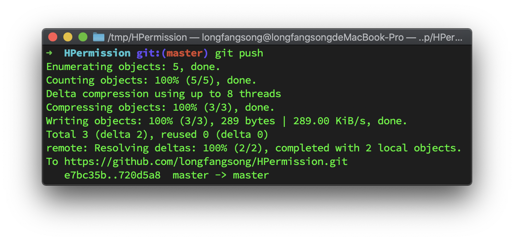

如果远程仓库修改了而本地没有修改，可以使用 `git pull` 命令将代码下载到本地：

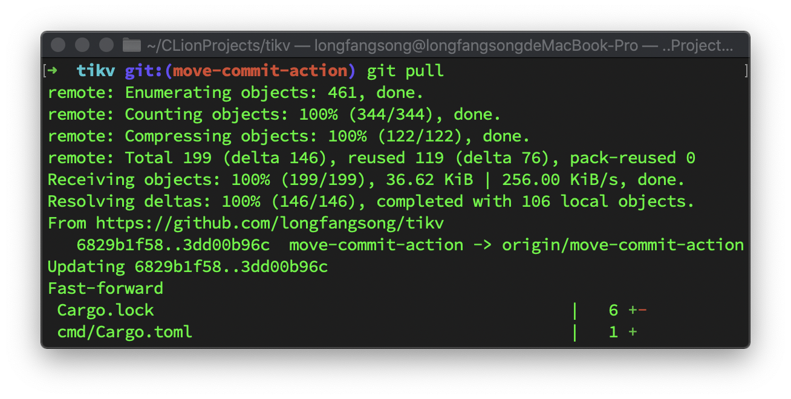

如果有多个远程分支需要跟踪（比如你希望你在修改的代码可以和fork的上游仓库的最新修改保持同步），那么可以使用 `git remote` 添加其他要跟踪的远程分支：

```shell
git remote add upstream https://github.com/shuosc/HPermission.git
git remote set-url --push upstream no_push # 不往 upstream 上 push, 因为你没有权限啊
```

然后更新的时候指定从 upstream master 上 pull

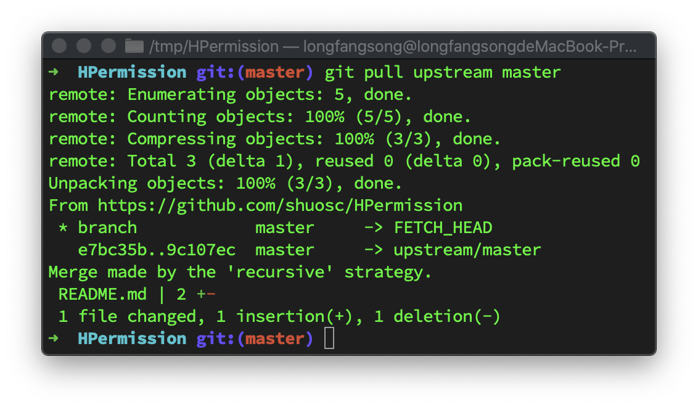

注意这里生成了一个新的提交，因为 `git pull` 实质上做的是一次 `git fetch` 加上一次 `git merge`，如果不希望生成这个提交可以使用 `git pull --rebase` ，这里的 `merge` 和 `rebase` 是啥我一会讲分支的时候讲。

### 提pull request，让别人采用你的修改

用如下的方式创建一个 pull request：

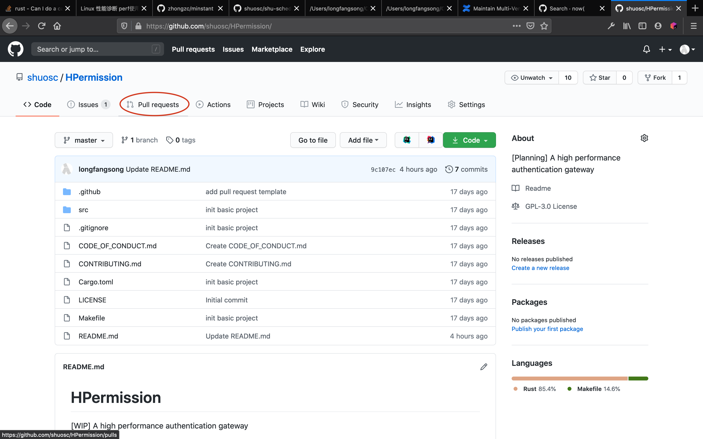

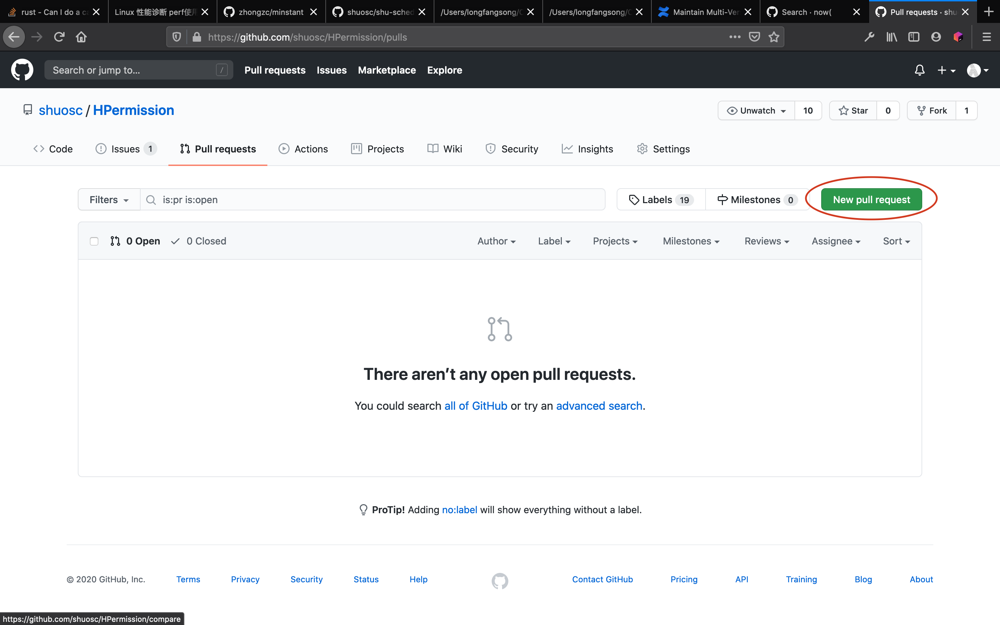

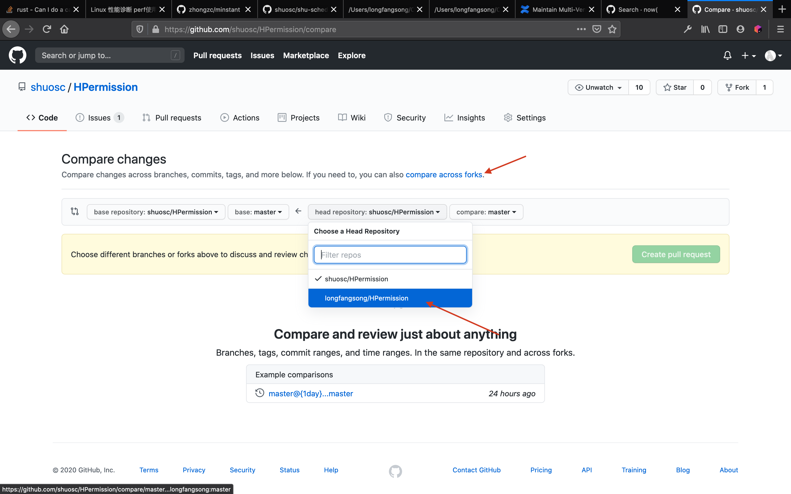

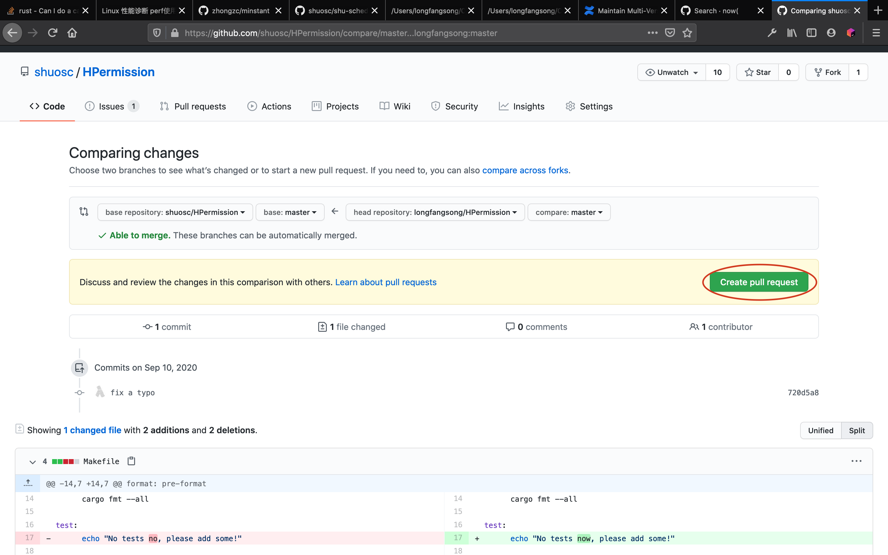

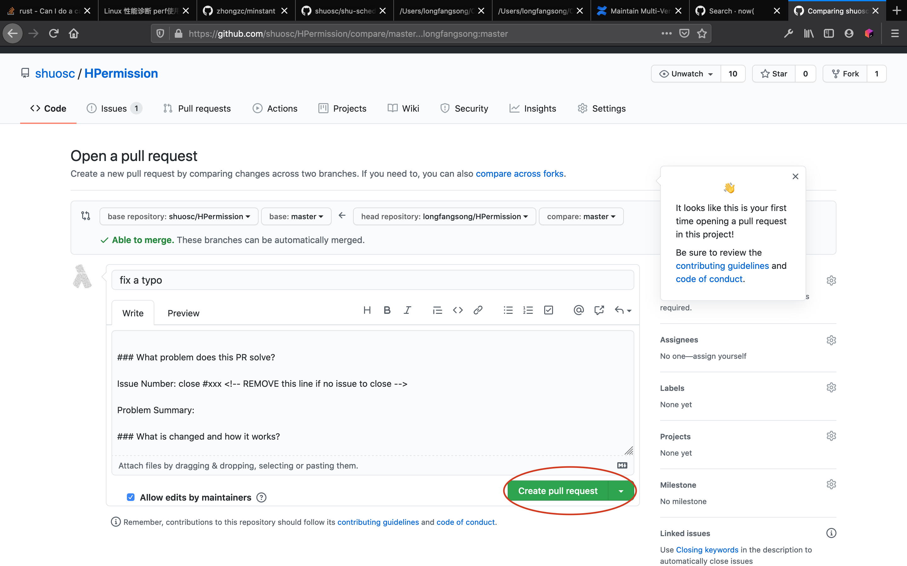

创建完之后就只要天天等着对方给你提意见就好了，如果没人理你就去催一催，如果人家有提出修稿意见你就改好按原样push到你自己的仓库就行。

## 分支

当我们进行了一些开发之后。

我们可能会想要

- 同时进行多个功能的开发
- 在开发功能的同时，修复bug
- 保留多个版本的代码，开发新功能的同时，对旧版本代码进行长期维护

这种情况下我们就需要用到 Git 的分支功能。

分支及其合并其实是 Git 中最难的一部分。

### 创建和切换

使用 `branch` 命令创建一个分支，用 `checkout` 在分支间切换（提示：`git checkout -b` 可以同时做这两件事）：

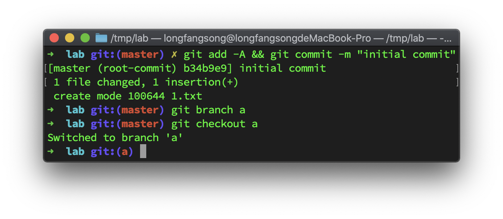

切换到某个分支之后，以后的提交都会提交到这个分支上。

而push的时候，如果是clone下来的分支，会直接push到对应的分支上，否则要push的同时创建：

```shell
git push 远端名 本地分支:远端新分支
```

之后的push都会push到remote的这个分支上。

### Merge

（我这里就讲最基本的 `Fast-forward` 合并和默认的合并（`Recusive` 合并））

当你在某个分支开发了很久之后，觉得你这个功能做的差不多了，那就可以把它merge回master分支，或者这个时候master分支比如说修了一些bug，你希望你的功能分支中的这些bug也不要出现，那么你就可以把master合并到你的功能分支上。

这个merge操作其实很有讲究，有些场景很多经验丰富的老司机也搞不定。

#### `Fast-forward` 合并

FF合并是一种很简单的情况：要合并入的分支自从这个分支被创建以来根本没改过，那就很方便了，只要把要合并入的分支的头节点移到这个分支的头节点就好了。

#### 其他情况下的合并

其他情况下的合并其实默认走的是一个 `recusive three-way merging` 的算法，这个算法我一会讲原理的时候会提，我们先来看他的效果。

先准备一个有两个分支，每个分支都提交了修改，的仓库：

  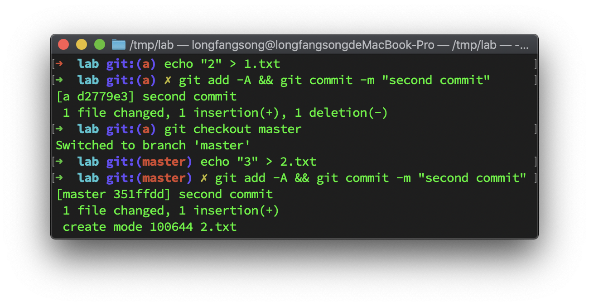

然后把master merge进a：

```shell
git merge master
```

会跳出窗口让你填 commit message，可见每次提交都会生成一次新的commit：

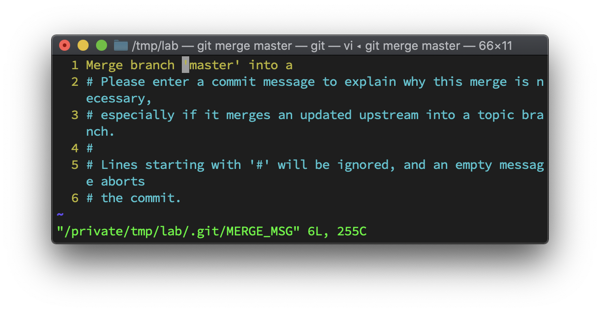

然后merge完之后你可以发现master中的修改过来了：

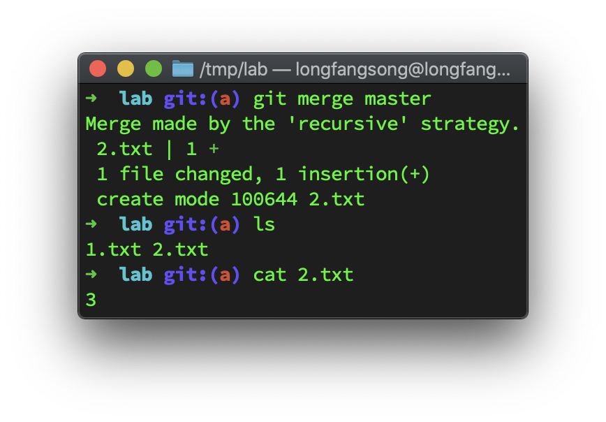


这次合并很舒服，没有冲突，下一次可能就没那么幸运了：

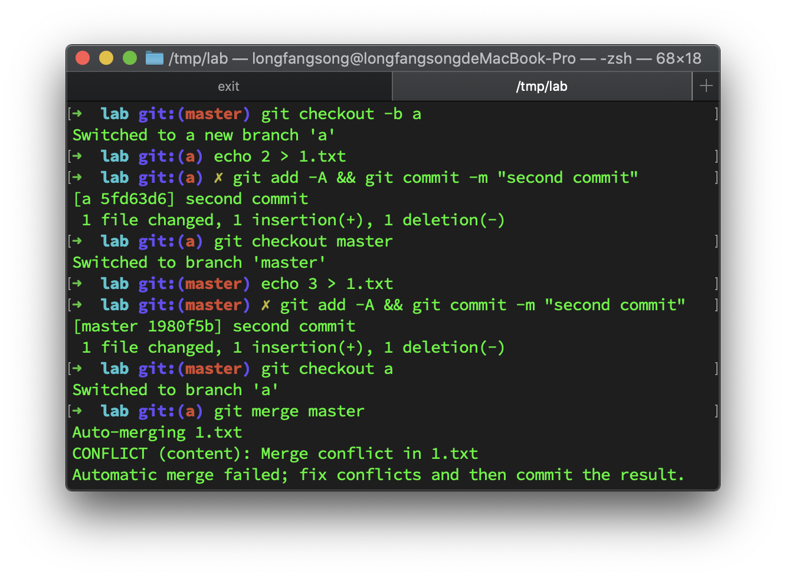

这次修改了同一个文件的同一个位置的两个文件想要merge，那git就看不出这里该怎么处理了，会请求我们手动处理，我们打开它报冲突的1.txt:

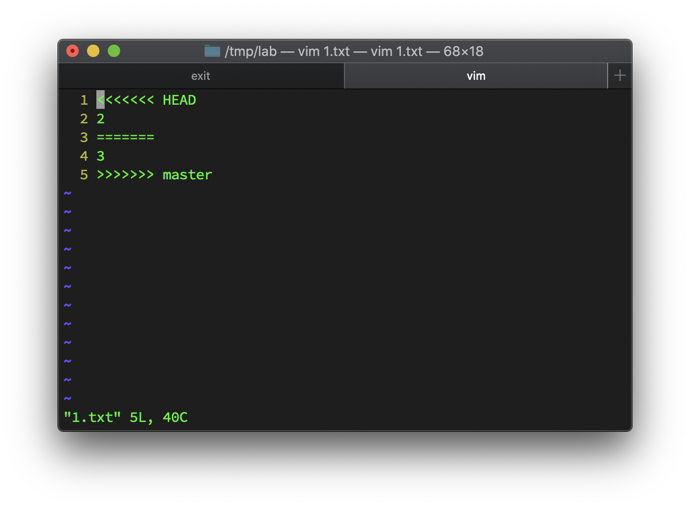

会用这样的记号标记出文件中不能自动合并的部分，我们要手动把文件修改成你想要的样子，比如这里是两者全部保留，你也可以保留其中一个分支上的更改，丢弃另一边的更改：

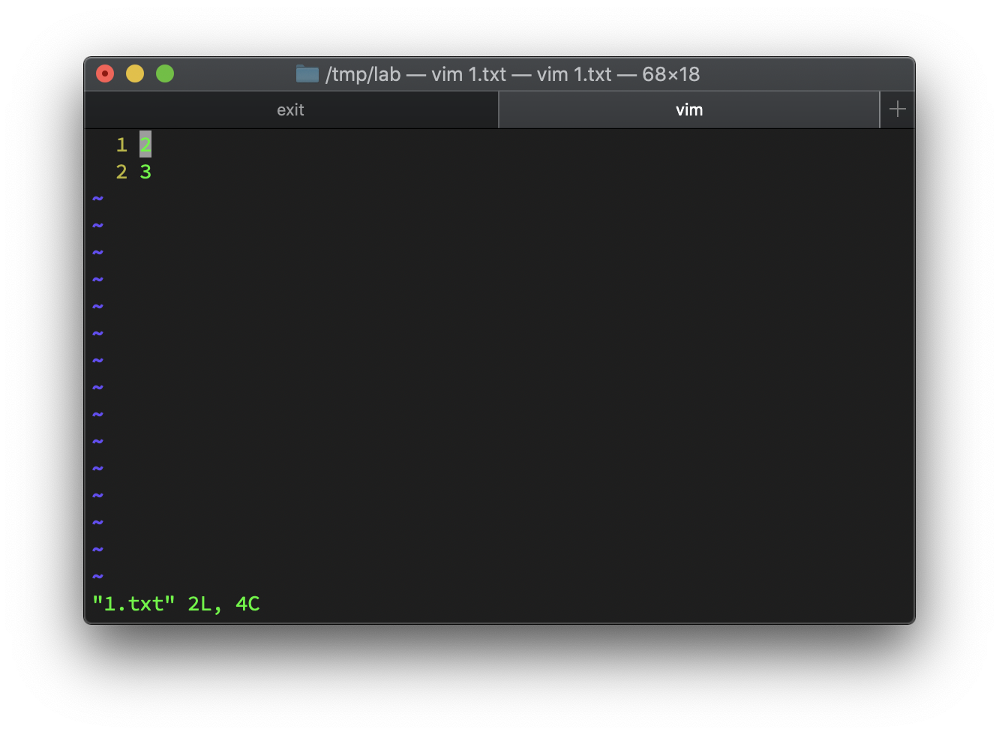

然后用`git add` 把你修改好的文件提交到暂存区，接着`git merge --continue` 继续你的合并：

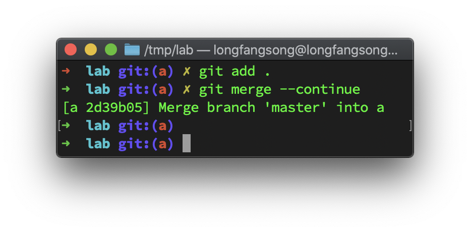

如果你的冲突都解决完了，那这里就可以继续合并下去了。

### Rebase

merge确实可以把别的分支上的修改拿到本分支上来，但是他会导致多一次提交，而如果经常merge修改的话，你的git分支图就会变成这样：

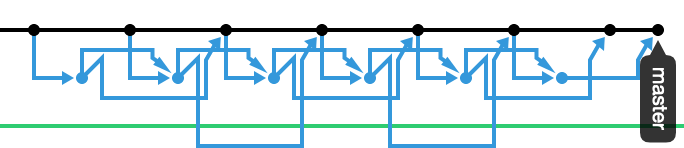

当然这个图夸张了一点，当年我还处在一个迷信IDE的阶段，然后不懂merge什么的的原理嘛，他跳出来让我选merge那我就选了，结果我的分支图……所以说别迷信IDE和图形界面就是这个道理。

那么rebase和merge有啥区别呢，rebase中文名称叫变基，就是变更这个分支从某个分支分叉出来的位置的意思。

rebase常见的用法是功能分支从主分支中获取最新的变更。

比如我功能分支和主分支都做了一些更改，我现在希望我的功能分支上能应用主分支上的更改，那么我们就能使用rebase，让功能分支“看起来”是从主分支的最新提交位置上fork出来的。

注意rebase的时候也会遇到冲突，这种时候像merge的时候一样解决就好了。

### cherry-pick

cherry-pick 用来从其他的分支上选择几个提交，应用到当前分支上。

比如我们在master分支上引入了一个关键的修复，同时我们的几个长期支持的分支上也有这个bug，但是这个修复他体现为只是一个commit，而不是一个分支之类的，这种时候我们就可以从我们的各个版本的分支上把这个commit cherry-pick 过来应用，达到我们的目的。

## 很有用的邪道

这些东西我不讲，虽然它们超级有用但是是邪道，有兴趣自己学：

- force push （会覆盖远程提交，修不小心上传的垃圾代码非常爽，但是一不小心就会……）
- stash（把修改存在一个不属于工作区也不属于暂存区的地方，然后回滚，非常容易滥用，很多人懒得开新分支就在stash里面乱做实验【我就是😭】）


[^1]: 如果你是windows上装这个我还真不一定帮的了你……