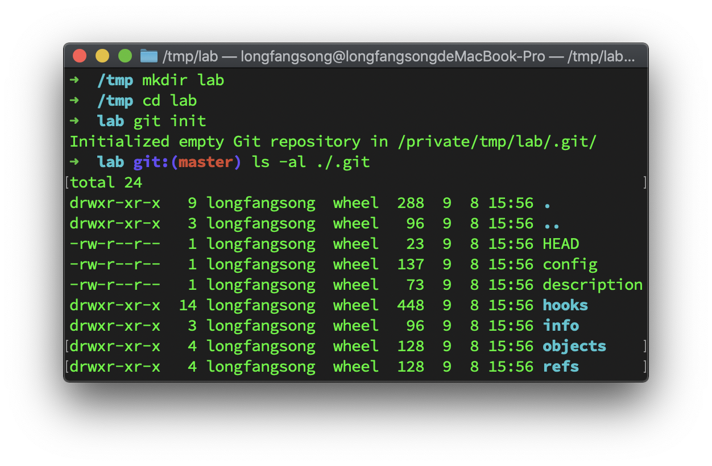
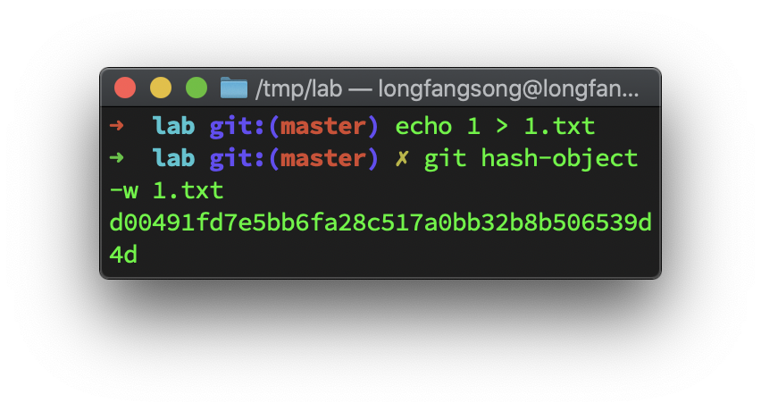
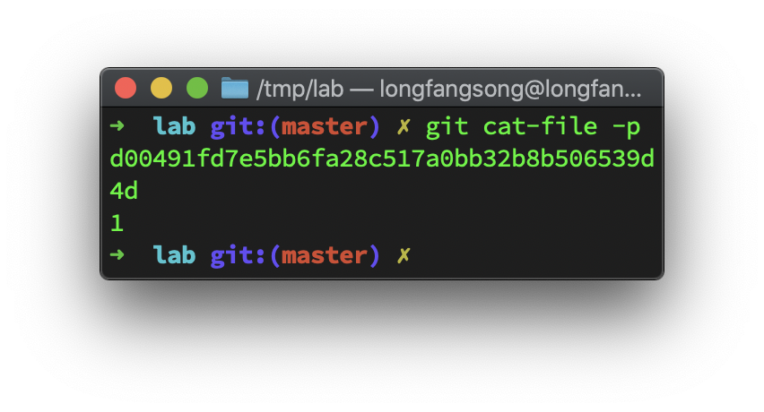
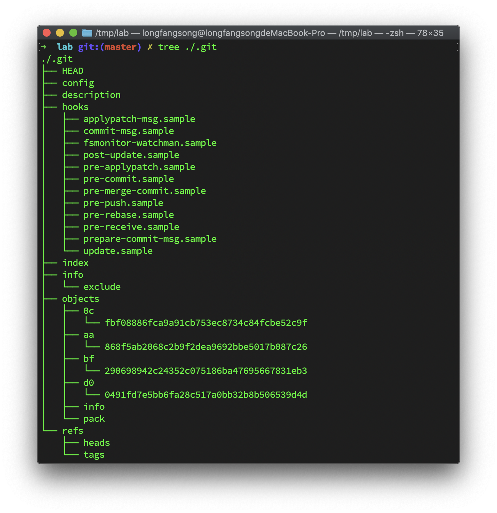
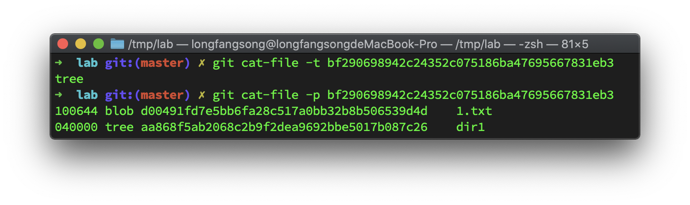
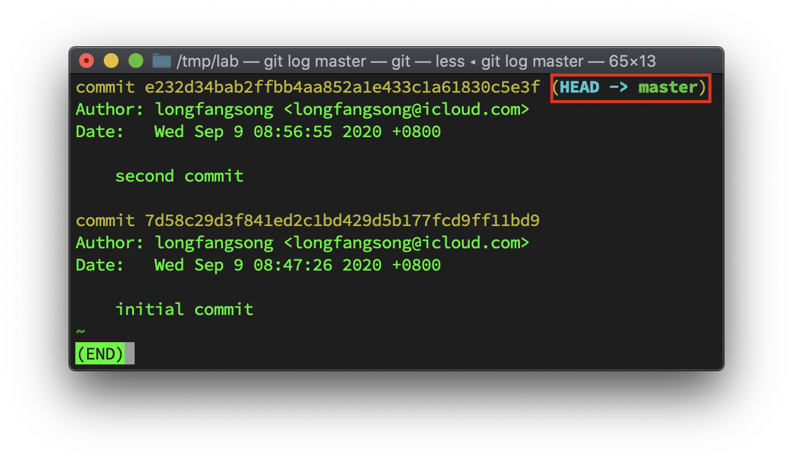

## Git is a database ...

Git 首先可以用作一个键值数据库：

我们先创建一个空的 Git 仓库：



这个数据库的数据都在`objects`里面，我们放一个文件进去：



可以看到生成了一长串哈希值，这个哈希值就是一个 `key`，是原本文件**内容**的一个摘要，可以拿着这个key去找对应的value。



实际存的时候，这里是按照“loose”方式存的，即把文件存在一个以这个`key`前两位为文件夹名，后面的几位为文件名的文件，这种文件我们称之为blob。

注意直接cat这个文件是乱码，因为 Git 里这个文件是用zlib压缩过的。

再对这个文件做一点修改：


可见这里 Git 的做法非常简单粗暴：并不去“思考”和原本文件的差别，而是直接创建一个新的文件，这也很正常，本来我们现在在就是数据库层面的事情，它不该对文件位置什么的有所知。

不过有的同学可能会觉得每次都创建一个新的文件会比较浪费（尤其是代码这个东西明明其实很多时候两个版本之间的文件就差几个字），Git也考虑到了这种情况，因此当文件多了或者你要把存储库推送到远程服务器上时，或者你手动跑 `git gc` 的时候，Git会把一些你已经commit过的相似的文件压缩成一个pack，以此来节约空间。

## ... with knows about filesystem ...

数据库解决了文件的存储问题，但是这里只有文件，没有目录，没有文件名，什么都没有。

为了解决存目录的问题，Git 提供了另外一种也存在“数据库”里的对象：tree 来表示目录。

我们先创建一个如下的文件夹：

```shell
.
├── 1.txt
└── dir1
    └── 2.txt
```

然后把文件放入暂存区（使用`update-index`）：

```shell
git update-index --add ./1.txt
git update-index --add ./dir1/2.txt
```

注意 `update-index` 同时也做了 `hash-object -w` 的操作。

再

```shell
>>> git write-tree
<<< bf290698942c24352c075186ba47695667831eb3
```

然后看看现在`.git`文件夹里有些啥子东西：

`index` 文件代表了目前暂存区有些个啥子文件：

```shell
cat .git/index                     
DIRC_W?+,UZ?_W?+,UZ??????????~[??(???2??S?M1.txt_W?1 ???_W?1 ?????????
                                                                      ????????S?4?O??,?
dir1/2.txt???Y?PߖQ??§q? R%
```

虽然是二进制文件但是还是可以看出 `1.txt` 和 `dir1/2.txt`。

我们 `write-tree` 得到的键是 `bf290698942c24352c075186ba47695667831eb3`，我们来看一下这个文件它里头到底是啥：



可以看到就是“根”目录里面有哪些子文件（夹）的情况，子文件就一blob，而子文件夹是另外一棵tree。

这样我们就解决了文件夹存放的问题。

## ... and it supports mvcc

然后就到了 Git 真正做版本控制的地方，这主要是通过 commit 对象实现的。

```shell
>>> git commit-tree  bf290698942c24352c075186ba47695667831eb3 -m "initial commit"
<<< 7d58c29d3f841ed2c1bd429d5b177fcd9ff11bd9
>>> git cat-file -p 7d58c29d3f841ed2c1bd429d5b177fcd9ff11bd9
<<< 
	tree bf290698942c24352c075186ba47695667831eb3
	author longfangsong <longfangsong@icloud.com> 1599612446 +0800
	committer longfangsong <longfangsong@icloud.com> 1599612446 +0800

	initial commit
```

我们就创建了一个提交对象，然后只要把新的提交对象和旧的连起来：


```shell
git log e232d34bab2ffbb4aa852a1e433c1a61830c5e3f
```

看下log：

这就是一个典型的 `git log` 记录。

但是我们平时用的分支他的名字肯定不是一个 hash 值，那肯定是 master 这样的名字，git为了支持给分支命名，提供了 `refs` 的功能，我们只要把一个commit对象对应的键保存在以引用的名字命名的文件中即可：

```shell
echo "e232d34bab2ffbb4aa852a1e433c1a61830c5e3f" > .git/refs/heads/master
```



## merge 算法

解决上面这个问题之后，这个 `merge` 变成了难点：除了可以fast forward的情况之外，我们merge的过程中一定是会出现冲突的，即要merge的两个版本中的文件不一样的问题。

有些解决策略很简单粗暴，比如：

- `ours`

  无脑采纳己方修改

- `theirs`

  无脑采纳对方修改

但有的时候是真的需要比较两个版本，看采纳哪一部分。

仅仅比较两个版本是无法看出冲突中要保留哪一个的，这很容易理解：两个版本如果有差异，我们不可能知道要采用哪边的版本。

但是如果找出两个版本公共的祖先版本，然后两个版本都和它比较，如果祖先版本和某个版本在这个地方是一样的，那么我们可以认为这个版本没有改这个部分，而另一个版本改了，那么就应该采用另一个版本，这个算法就叫三路归并，resolve策略执行的就是这种merge。

这个算法说起来很简单，但执行过程中会遇到找到不止一个公共祖先的问题，这种时候采用递归合并策略，就是如果发现多个公共祖先，那就先合并这多个公共祖先，直到只有一个公共祖先为止，然后递归向上合并，这也是默认的行为。

还有一个叫`octopus`的策略用于合并多个分支，`subtree` 策略在合并树A和树B时，如果B是A的子树，B首先调整至匹配A的树结构，这两个用的比较少，就不细说了。

## 其他

还有一些要知道的信息：

`.git/config`会存：

- 有哪些远程分支

- 跟踪远程分支

- submodule相关

  

仓库上传时

可以使用简单的HTTP传输，用你能想到的那种最简单的方式

也可以定制协议，`send-pack`、`receive-pack`等。

## 总结

本文讲述了 git 的几个更为“基本”的命令，从而剖析了 Git 的内部工作原理。

简单来说：

- Git 将文件内容、文件夹结构、commit内容都保存在 `.git/objects` 下，并有一个键与其中每个文件对应
- Git 将分支保存在 `.git/refs` 里
  - 其中 `heads` 存的是每个本地分支的头节点对应的 `commit` 号
  - 前面没有提过，但远程分支对应信息在 `.git/refs/remotes/远程名/分支名` 里
  -  前面没有提过，但tag对应信息在 `.git/refs/tags/tag名` 里

上述所有内容均会在Git认为合适的时候被pack成更节约空间的形式。

那么我们就可以自己推出一些我们更常用的命令的实现：

- `add`

  `update-index`

- `commit`

  `write-tree` + 更新 `refs`

- `checkout`

  1. 查 `refs` 得其对应 `commit`
  2. 查 `commit` 得其对应 `tree`
  3. 递归从 `tree` 中解出文件，并覆盖工作区的对应文件
  4. 更新 `HEAD`，记录当前所在分支

- `fetch`

  下载远程仓库 `refs` 信息到 `.git/refs/remotes`，并下载缺失的 `object`。

  同时会更新 `FETCH_HEAD` ，记录本地上次fetch到哪里了

- `push`

  与上述相反

- `pull`

  1. `fetch`
  2. `merge FETCH_HEAD`

- `merge` (no-ff)

  1. 进行某种three-way merging，如有必要手动解决冲突，结果放在工作区
  2. `update-index`
  3. `write-tree` + 更新 `refs`，生成的 commit 有两个爹，其他也没啥特别的

- `cherry-pick`

  1. 进行某种three-way merging，如有必要手动解决冲突，结果放在工作区
  2. `update-index`
  3. `write-tree` + 更新 `refs`，生成的 commit 其 parent 是cherry-pick到的分支的head，tree是刚刚write的tree，其他都和cherry-pick来的那个 commit 一样

- `rebase`

  1. 进行某种three-way merging，如有必要手动解决冲突，结果放在工作区
  2. 更新 commit，内容不变，但是会更新commit id，并重新认爹。


