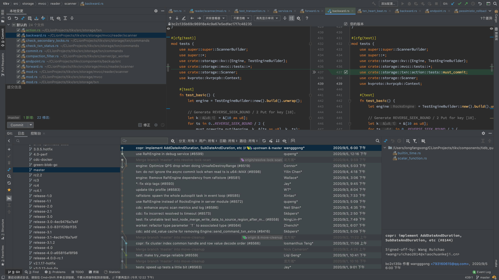

- 管理变更，而非文件

  回忆我自己手动管理文件版本的时代，要存下代码仓库的一个版本，那我就会把所有文件打一个压缩包，起一个`xxx-v0.zip`，`xxx-v1.zip`之类的名字，然后放在某个文件夹里面。

  这样确实解决了版本管理的问题，但是遇到协作的情况：

  - 两个同学同时开发，然后想把代码合并起来
    - 改了不同的文件，两份全部复制过来就可以了
    - 改了同一个文件的不同部分，这下可就麻烦了，要手动打开两个不同的文件，把修改的部分分别复制过去，要是一没看清楚有个小但重要的代码部分没有复制过去，那就完蛋了

  所以就算是最早的协作手动版本管理模式，也是开发者们将他们写的代码和原本代码的**差异**，也就是他们在原代码的基础上做的**修改**（手动地或自动地）计算出来，并发送给核心代码维护者，让核心代码维护者在原代码的基础上（手动地或自动地）重做这些修改。

  这就是版本管理的一个重要思想：管理的是变更，而不是每一个文件。
  $$
  现有状态 = \sum 每一个修改
  $$
  这个思想其实很重要，在函数响应式编程等等方面也用到的很多，也催生了我后面要讲的多版本并发控制。

  后来几乎所有的版本控制系统至少在逻辑上都管理的是变更，为什么要说逻辑上呢，因为要注意到如果直接记录所有的变更，要获得某个时刻的代码，那就需要从一个什么都没有的状态重放所有的更改，直到某个版本为止，如果版本多，效率是很差的，Git就针对这个问题进行了优化，我将在后面的实现原理中介绍。

- 工作区、暂存区与版本库

  工作区很好理解，就是我现在工作所在的这个文件夹里面所有的文件。

  版本库也好理解，就是一个存了历史版本相关数据的地方。

  那暂存区是个啥玩意呢？

  暂存区就是一个文件的列表，Git在这次提交到版本库的过程中，**只**会跟踪**这部分文件上的变更**。

  为啥要整这么个东西呢？直接从工作区放到版本库里面它不香嘛？

  一般来讲是挺香的，这也就是为啥 svn 这类的版本控制工具为何没有这种东西。

  但是考虑一种情况：

  - 你在写一个新的小模块，用来替换一个旧的模块，这个模块将被几个其他模块调用。现在由于某些原因你没有调试器用（比如你在一些没有调试器支持的平台上）
  - 为了调试方，你在调用方的代码里面加了一堆`print`语句
  - 现在你写完了代码，准备提交到仓库里，你当然不准备提交那些只加了几个`print`的文件上的变更

  如果没有一个暂存区，那你就得这时选择出哪些文件要上传到版本控制，哪些不用，将其作为参数传给命令。

  而如果有一个暂存区，那你可以创建一个文件就将其添加到暂存区，也可以一次全部添加然后拿走你不需要的，甚至可以将你的文件的一部分添加到暂存区，也就是说，对要实际将代码中的哪些更改上传，有一个更好的控制。

  不过如果你有一个GUI的话，那挑选哪些东西要提交哪些不需要就会方便很多：

  

  但是当年可没这种好东西，所以当年 Linus 大神就整了个暂存区。

  这里要提一下的是，无论是在用Git的时候还是搞别的：

  - 不要不了解命令行

    新手常常会觉得IDE里有这个功能了我干嘛还要去了解命令行，这种思想其实是不很正确的，命令行里的命令的功能的丰富程度和便于组合的特性是远超GUI能提供的那些的。况且也不是每个环境下都支持你启动IDE。

  - 不要排斥IDE

    这是某些相对有些水平或者有些想法的同学常常会觉得相比命令行 IDE 很 low，用 IDE 的人都是弱者，那我觉得这种思想其实也是完全没有必要的，有些情况下图形界面确实是比较方便，比如解决 Git merge过程中的冲突等等。

