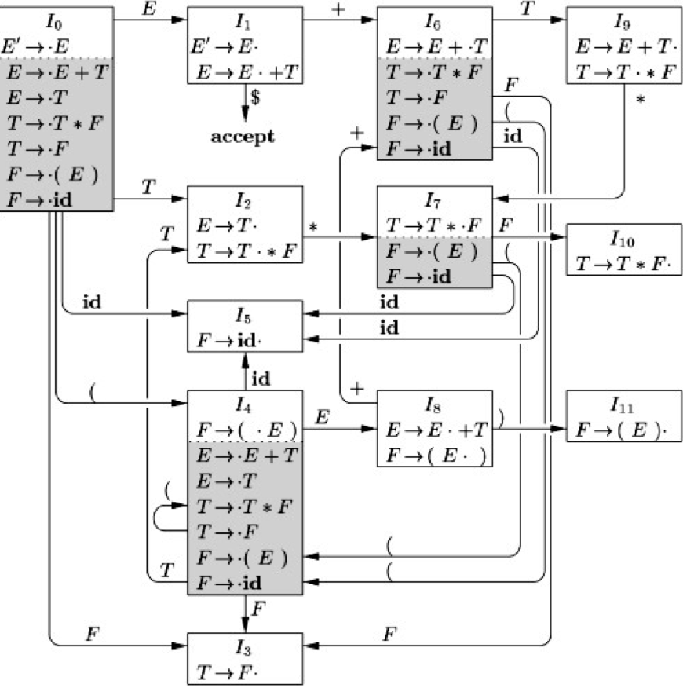

如果你已经理解了[移进-归约分析](https://longfangsong.github.io/2020/05/22/%E7%A7%BB%E8%BF%9B-%E5%BD%92%E7%BA%A6%E5%88%86%E6%9E%90/)的基本执行流程了，那么你一定会问，我该如何决定某个步骤上应该“移进”还是应该“归约”呢？应该选择哪个推导式来归约呢？毕竟如果我们构造的文法和表达式求值一样简单，那手动根据“栈中现有的值”和“下面要输入的值”来判断就可以了，那么如果我们处理的文法比较复杂呢？

举一个经典的表达式文法的例子：
$$
E \rightarrow E+T|T \\
T \rightarrow T*F|F \\
F \rightarrow (E) | \bold{id}
$$
我们来模拟一下匹配字符串$\textbf{id}*\textbf{id}+(\textbf{id}+\textbf{id})*\textbf{id}$的过程，并尝试解释每一步选择移进还是归约的原因。

| 符号栈           | 剩余输入                                              | 动作             | 原因                                                         |
| ---------------- | ----------------------------------------------------- | ---------------- | ------------------------------------------------------------ |
|                  | $\textbf{id}*\textbf{id}+(\textbf{id}+\textbf{id})*\textbf{id}$ | 移进 $\textbf{id}$ | 没得选                                                       |
| $\textbf{id}$    | $*\textbf{id}+(\textbf{id}+\textbf{id})*\textbf{id}$  | 栈顶归约为 $F$   | 下一个符号是$*$，而没有包含 $\textbf{id} *$ 的规则，但栈顶可以归约 |
| $F$              | $*\textbf{id}+(\textbf{id}+\textbf{id})*\textbf{id}$  | 栈顶归约为 $T$   | 下一个符号是$*$，而没有包含$F *$ 的规则，但栈顶可以归约 |
| $T$              | $*\textbf{id}+(\textbf{id}+\textbf{id})*\textbf{id}$  | 移进 $*$         | 下一个符号是$*$， 而没有包含 $ T *$ 的规则              |
| $T*$             | $\textbf{id}+(\textbf{id}+\textbf{id})*\textbf{id}$   | 移进 $\textbf{id}$ | 栈顶不能归约，只能移进                                       |
| $T*\textbf{id}$  | $+(\textbf{id}+\textbf{id})*\textbf{id}$              | 栈顶归约为 $F$   | 下一个符号是$+$，而没有包含 $T *\textbf{id}+$ 或者 $\textbf{id}+$ 的规则，但栈顶可以归约 |
| $T*F$            | $+(\textbf{id}+\textbf{id})*\textbf{id}$              | 栈顶归约为 $T$   | 下一个符号是$+$，而没有包含$T * F+$ 或者 $F+$ 的规则，但栈顶可以归约 |
| $T$              | $+(\textbf{id}+\textbf{id})*\textbf{id}$              | 栈顶归约为 $E$   | 下一个符号是$+$，而没有包含$T+$ 的规则，但栈顶可以归约 |
| $E$              | $+(\textbf{id}+\textbf{id})*\textbf{id}$              | 移进 $+$         | 栈顶不能归约，只能移进                                       |
| $E+$             | $(\textbf{id}+\textbf{id})*\textbf{id}$               | 移进 $($         | 栈顶不能归约，只能移进                                       |
| $E+($            | $\textbf{id}+\textbf{id})*\textbf{id}$                | 移进 $\textbf{id}$ | 栈顶不能归约，只能移进                                       |
| $E+(\textbf{id}$ | $+\textbf{id})*\textbf{id}$                           | 栈顶归约为 $F$   | 下一个符号是$+$，而没有包含 $\textbf{id}+$ 的规则，但栈顶可以归约 |
| $E+(F$           | $+\textbf{id})*\textbf{id}$                           | 栈顶归约为 $T$   | 下一个符号是$+$，而没有包含 $F+$ 的规则，但栈顶可以归约      |
| $E+(T$           | $+\textbf{id})*\textbf{id}$                           | 栈顶归约为 $E$   | 下一个符号是$+$，而没有 包含 $T+$ 的规则，但栈顶可以归约     |
| $E+(E$           | $+\textbf{id})*\textbf{id}$                           | 移进             | 栈顶不能归约，只能移进                                       |
| $E+(E+$          | $\textbf{id})*\textbf{id}$                            | 移进             | 栈顶不能归约，只能移进                                       |
| $E+(E+\textbf{id}$ | $)*\textbf{id}$                                       | 栈顶归约为 $F$   | 下一个符号是$)$，而没有 包含 $\textbf{id})$ 的规则，但栈顶可以归约 |
| $E+(E+F$         | $)*\textbf{id}$                                       | 栈顶归约为 $T$   | 下一个符号是$)$，而没有 包含 $F)$ 的规则，但栈顶可以归约     |
| $E+(E+T$         | $)*\textbf{id}$                                       | 栈顶归约为 $E$   | 下一个符号是$+$，而没有包含 $T)$ 的规则，但栈顶可以归约      |
| $E+(E+E$         | $)*\textbf{id}$                                       | 移进             | 栈顶不能归约，只能移进                                       |
| $E+(E+E)$        | $*\textbf{id}$                                        | 栈顶归约为 $F$   | 下一个符号是$*$，没有包含 $)*$ 的规则，但栈顶可以归约        |
| $E+F$            | $*\textbf{id}$                                        | 栈顶归约为 $T$             | 下一个符号是$*$，没有包含 $F*$ 的规则，但栈顶可以归约        |
| $E+T$            | $*\textbf{id}$                                        | 移进             | 这里是tricky的地方，这里考虑到优先级问题必须移进，这样看来**优先移进，不行了再归约可能是处理优先级问题的方案** |
| $E+T*$          | $\textbf{id}$ | 移进 | 栈顶不能归约，只能移进 |
| $E+T*\textbf{id}$ |  | 栈顶归约为 $F$ | 没有符号了，往死里归约 |
| $E+T*F$ |  | 栈顶归约为 $T$ | 没有符号了，往死里归约 |
| $E+T$ |  | 栈顶归约为 $E$ | 没有符号了，往死里归约 |
| $E$ |  | 接受 |  |

这是一个漫长的过程，在这个过程中我们发现：

- 为了处理运算符的优先级，优先进行移进
  - 这和我们编写计算器的方式很像
- 在移进会导致栈中不包含某个可以归约的“前缀”时，必须先归约
- 在栈中的内容不同时，要考虑的是否可以归约的部分也不一样
  - 例如在处理栈为 $T*$ 和 $E+T*$ 时，其实都只要考虑 $T*$ 的部分就可以了

那么我们可以看一下有哪些方法解决这些问题。

## LR(0)项、状态、产生式中的“$\cdot$” 与LR(0) 状态机

我们从前面的最后一个问题开始着手。

我们看 $E+T*$ 这里，在这种**状态**下，我们能用来归约的产生式只有 $T \rightarrow T*F$ 一个，会归约到栈顶上多了一个 $T$ 的状态。[^0]

而在 $T*$ 这里，在这种**状态**下，我们也能用来归约的产生式只有 $T \rightarrow T*F$ 一个，也只会归约到栈顶上多了一个 $T$ 的状态。

可以看出从“往栈上放一个$T$的角度来看”这两个状态其实是同一个状态。

### LR(0)项

我们引入$\cdot$标记来分割生成式匹配过了的部分和还需要匹配的部分，所以现在这个状态可以写成：
$$
T \rightarrow T*\cdot F
$$
也就代表在这个状态下，已经匹配到了$T*$，接下来如果能成功地匹配到一个$F$，就能顺利地归约为栈顶上的一个 $T$。

像这种标记过匹配到的状态的产生式，我们称之为“LR(0)项”，简称“项”。

### 项集闭包

我们考虑上面说到的 $T \rightarrow T*\cdot F$，以及另外两个项：
$$
F \rightarrow \cdot(E) \\
F \rightarrow \cdot \bold{id}
$$
我们可以看到在 $T \rightarrow T*\cdot F$ 项的对应状态下，上面两个项所代表的状态其实就是 $T \rightarrow T*\cdot F$ 在试图匹配 $F$ 时的“子状态”或“等价状态”。

那么我们就把这两个状态和原先的 $T \rightarrow T*\cdot F$ 放在一个集合里面，称之为“ $T \rightarrow T*\cdot F$ 的项集闭包”，其中 $T \rightarrow T*\cdot F$ 称为闭包的核心。

那么项集闭包有啥用呢？我们仍然举上面文法的例子：

比如现在栈中有$...T*$，我们在 $T \rightarrow T*\cdot F$ 状态，我们看到前面有一个$'('$，此时我们就可以根据这个$'('$ 和项集闭包中的$F \rightarrow \cdot(E)$，转到$F \rightarrow (\cdot E)$ 状态，然后去匹配出一个一个 $F$，放到栈顶，然后进行 $T$ 的归约。

把所有的项、对应的项集闭包以及状态之间的转换关系列出来，我们就可以建立起一个 LR(0) 状态机：

可以看到每一个产生式对应的所有项都会出现在这个状态机里面，而每条边上则指示了在栈顶又被压入某个符号时的状态转换。

其中$E'$是为了标记我们最终匹配到什么而设置的，其实这个例子来讲说到底就是$E$。

#### 上述过程的算法描述

这部分看看就行了，看懂了上面的你可以自己想到这些的。

根据龙书，上面的过程的算法描述为：

- 求每个LR(0)项，直接往所有每个产生式里能插的地方（包括开头和结尾）插入“$\cdot$”即可

- 对开始符号所在的项 $S'\rightarrow \cdot S$，求其闭包

- 寻找每个我们拿到的闭包在某个输入下转换到的项集（称为$GOTO$函数）

  - 求法

    > “If $A → α·Bβ$ is in $CLOSURE(I)$ and $B → γ$ is a production, then add the item $B → ·γ$ to $CLOSURE(I)$, if it is not already there. Apply this rule until no more new items can be added to $CLOSURE(I)$.”

- 重复上一步，直到不再有新的项集出现为止

### 使用 LR(0) 状态机进行匹配

为了存储一路匹配上来时经过的状态，我们需要在分析表中增设一个状态栈。

我不想再画上面那一百万行的巨大表格了，所以我们这次直接用龙书上的例子：

分析$\textbf{id} * \textbf{id}$：

| 状态栈         | 符号栈          | 剩余输入                    | 动作                                                         |
| -------------- | --------------- | --------------------------- | ------------------------------------------------------------ |
| $I_0$          |                 | $\textbf{id} * \textbf{id}$ | 根据状态机的标识，转到$I_5$（即压入状态栈），同时移进 $\textbf{id}$ |
| $I_0I_5$       | $\textbf{id}$   | $* \textbf{id}$             | 根据状态机的标识，无处可转，进行归约，弹状态栈               |
| $I_0$          | $F$             | $* \textbf{id}$             | 弹栈后进行下一步状态转移，转到$I_3$                          |
| $I_0I_3$       | $F$             | $* \textbf{id}$             | 根据状态机的标识，无处可转，进行归约，弹状态栈               |
| $I_0$          | $T$             | $* \textbf{id}$             | 弹栈后进行下一步状态转移，转到$I_2$                          |
| $I_0I_2$       | $T$             | $* \textbf{id}$             | 根据状态机的标识，转到$I_7$，同时移进 $*$                    |
| $I_0I_2I_7$    | $T*$            | $\textbf{id}$               | 根据状态机的标识，转到$I_5$，同时移进 $\textbf{id}$          |
| $I_0I_2I_7I_5$ | $T*\textbf{id}$ |                             | 根据状态机的标识，无处可转，进行归约，弹状态栈               |
| $I_0I_2I_7$    | $T*F$           |                             | 弹栈后进行下一步状态转移，转到$I_{10}$                       |
| $I_0I_2I_{10}$ | $T$             |                             | 根据状态机的标识，无处可转，进行归约，弹状态栈               |
| $I_0I_2$       | $E$             |                             | 根据状态机的标识，无处可转，进行归约，弹状态栈               |
| $I_0$          | $E$             |                             | 弹栈后进行下一步状态转移，转到$I_1$                          |
| $I_0I_1$       | $E'$            |                             | 接受                                                         |

注意我这里的步骤比龙书上多了些，龙书将“弹栈后进行下一步状态转移”这一步和下面的步骤合并起来写。

其实说实话你可以把这个状态栈用函数（递归）调用的方法消去的。

### 冲突

看了上面的步骤你会发现，LR(0) 的每个项集闭包中不可以包含：

- 一个项认为已经可以归约了，另一个项认为还需要移进
  $$
  A \rightarrow a\cdot b \\
  B \rightarrow c \cdot
  $$
这称为移进-归约冲突。
  
- 两个项认为可以归约出不同的东西
  $$
  A \rightarrow b \cdot \\
  C \rightarrow d \cdot \\
  $$
  这称为归约-归约冲突。

有此类冲突的不是LR(0)文法，需要用其他分析方法分析。

[^0]: 这里也可以理解成，匹配完了$E+$ 之后，再递归地（用“干净”的栈帧）匹配后面的以$T*$开头的内容
