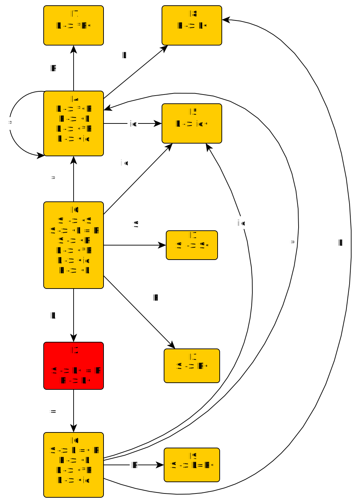

我们来看这样一个文法：
$$
S \rightarrow L = R | R \\\\
L \rightarrow *R | \textbf{id} \\\\
R \rightarrow L
$$
我们建立其 $LR(0)$ 状态机：

注意 $I_2$ 处的移进-归约冲突，假设在使用SLR(1)在这里匹配，栈中是$L$，下一个符号是 $'='$ 时，这里会发现：

- 下一个符号是 $'='$， 故应当移进
- 但 $'='$ 也在 $L$ 的 $FOLLOW$ 集中，故应当归约

而SLR对于这两种情况谁优先是没有规定的，于是这里这个移进-归约冲突靠SLR就解决不掉。

那么怎么解决这个问题呢？

我们先解决上面的特定问题：

我们先自己考虑在 $I_2$ ，下一个符号是 $=$ 的时候应该移进还是归约呢？

假设我们这一步选择归约，然后再下一步必然移进，那么我们的栈里有这样的一坨东西：$R = $，但是我们在产生式中完全找不到这样的结构，也就是说，无法进一步归约，所以我们这里不能归约，只能移进。

所以我们得到了一个选择移进还是归约的规则：仅当归约到的东西能被进一步归约时，我们才归约，否则就移进。

那么我们怎么在文法分析中的每一步的时候方便地看出“归约到的东西能被进一步归约”呢？

首先开始符号直接导出的符号（串）在遇到输入字符串的末尾时，一定能被进一步归约。

然后，若一个项目
$$
A \rightarrow 一坨东西 \cdot Bx
$$
在遇到 $a$ 时一定能被进一步归约，那么对于 $FIRST(xa)$ 中的 $y$ ，项 $B \rightarrow \cdot 另一坨东西$，在遇到 $y$ 时也一定能进一步归约。

这很好想，如果 $"一坨东西\ \ \ \ B\ \ \ \  FIRST(xa)中的一个 y"$ 可以规约为 $A$ 并继续归约，那么如果有另一坨东西可以归约为 $B$，那么 $"一坨东西\ \ \ \ 另一坨东西\ \ \ \  FIRST(xa)中的一个 y"$ 也一定能被归约为 $A$， 并继续归约。

我们会将这里的 $a$ 和 $y$ 放在原本的 $LR(0)$ 项的末尾，组成 $LR(1)$ 项：
$$
A \rightarrow 一坨东西 \cdot Bx, a \\\\
B \rightarrow \cdot 另一坨东西, y
$$
再用和求 $LR(0)$ 项集的方法类似的方法求出 $LR(1)$ 项集，并建立状态机即可进行匹配，只是这次求“等价状态”时，要保证其“可以进一步归约”的属性要等价。

