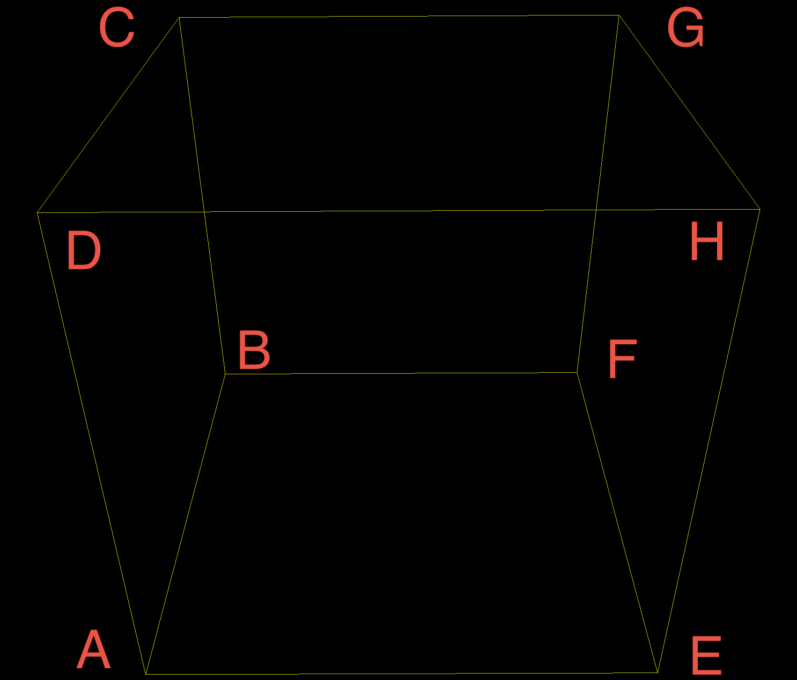

## 置换群

在集合 $X=\{1,2...,n\}$ 上的置换：
$$
\left(
\begin{array}{l}
1 & 2 & 3 & \cdots & n \\\\
k_1 & k_2 & k_3 & \cdots & k_n
\end{array}
\right)
$$
关于 置换的合成运算 构成一个群，称为 $n$ 阶对称群，其子群是一个置换群。

### 轨道

将一个集合 $S$ 根据通过某个元素通过置换群 $G$ 能否“变换到”分为多类，则某个元素的轨道即其能变换到的所有位置的集合。

### 不动点-轨道定理

对某个元素x：
$$
|G| = |x的轨道|\times |\{g\in G,g中x不动\}|
$$

## Burnside引理

轨道总条数等于所有置换中不动点个数的平均值：
$$
轨道总条数 = \frac 1 {|G|} \sum _{x\in X} |\{g\in G,g中x不动\}| = \frac 1 {|G|} \sum _{g\in G} |\{x\in X,g中x不动\}|
$$
例：
$$
G=\{e,(1\ 2),(3\ 4),(1\ 2)(3\ 4)\}
$$
则每个置换对应的不动点为：

- $e$

  $1,2,3,4$

- $(1\ 2)$

  $3, 4$

- $(3\ 4)$

  $1, 2$

- $(1\ 2)(3\ 4)$

  没有

故
$$
轨道总条数 = \frac 1 {|G|} \sum _{g\in G} |\{x\in X,g中x不动\}| = \frac 1 4 (4+2+2) = 2
$$

## Pólya 定理

对有 $m$ 种颜色的染色问题，
$$
|\{x\in X,g中x不动\}| = m ^ {g中循环的个数}
$$
带入Burnside引理，得到染色方案数：
$$
染色方案数 = \frac 1 {|G|} \sum_{g\in G}m^{g中循环个数}
$$

## 例题

立方体顶点，涂m种颜色：

不动，有恒等置换 $e$；

沿着两个相对面的中点连线（3个）旋转：

- 90度，得到形如 $(A\ D\ C\ B)(E\ H\ G\ F)$ 的置换
- 180度，得到形如 $(A\ C)(D\ B)(E\ G)(F\ H)$的置换
- 270度，得到形如 $(A\ B\ C\ D)(E\ F\ G\ H)$ 的置换

沿着两个相对棱的中点连线（6个）旋转180度，得到形如 $(D\ F)(E\ C)(B\ H)(A\ G)$的置换

沿着体对角线（4个）旋转：

- 120度，得到形如$(H\ F\ C)(E\ B\ D)(A)(G)$
- 240度，得到形如$(H\ C\ F)(E\ D\ B)(A)(G)$

所以共有：$(1)^8$型1个，$(1)^2(3)^2$型8个， $(2)^4$型9个，$(4)^2$型6个

即正方体置换群的循环指数为：
$$
G(X) = \frac 1 {24} (x_1^8+8x_1x_2^3+9x_2^4+6x_4^2)
$$
将各个颜色编码为$c_1,c_2,...,c_m$，并将 $c_1^i+c_2^i+...+c_m^i$ 带入 $x_i$ ，展开后各项系数之和即为总的方案数。某项之前的系数即为对应方案的方案数。

例如 $m=3$ :
$$
(a+b+c)^8+8(a+b+c)^2(a^3+b^3+c^3)^2+9(a^2+b^2+c^2)^4+6 (a^4+b^4+c^4)^2\\\\
=\\
a^{8} + a^{7} b + a^{7} c + 3 a^{6} b^{2} + 3 a^{6} b c +\\\\
3 a^{6} c^{2} + 3 a^{5} b^{3} + 7 a^{5} b^{2} c + 7 a^{5} b c^{2} +\\\\
3 a^{5} c^{3} + 7 a^{4} b^{4} + 13 a^{4} b^{3} c + 22 a^{4} b^{2} c^{2} +\\\\
13 a^{4} b c^{3} + 7 a^{4} c^{4} + 3 a^{3} b^{5} + 13 a^{3} b^{4} c +\\\\
24 a^{3} b^{3} c^{2} + 24 a^{3} b^{2} c^{3} + 13 a^{3} b c^{4} + 3 a^{3} c^{5} +\\\\
3 a^{2} b^{6} + 7 a^{2} b^{5} c + 22 a^{2} b^{4} c^{2} + 24 a^{2} b^{3} c^{3} +\\\\
22 a^{2} b^{2} c^{4} + 7 a^{2} b c^{5} + 3 a^{2} c^{6} + a b^{7} + 3 a b^{6} c +\\\\
7 a b^{5} c^{2} + 13 a b^{4} c^{3} + 13 a b^{3} c^{4} + 7 a b^{2} c^{5} +\\\\
3 a b c^{6} + a c^{7} + b^{8} + b^{7} c + 3 b^{6} c^{2} + 3 b^{5} c^{3} +\\\\
7 b^{4} c^{4} + 3 b^{3} c^{5} + 3 b^{2} c^{6} + b c^{7} + c^{8}
$$
则用a色涂4个顶点，b色涂3个顶点，c色涂1个顶点的等价方案数是13种。

