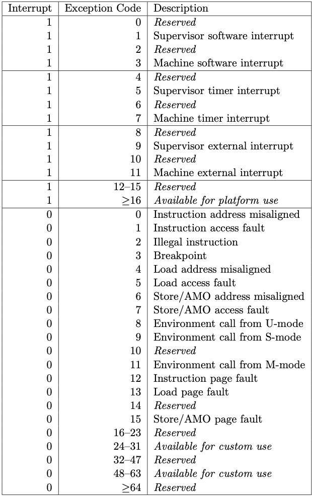
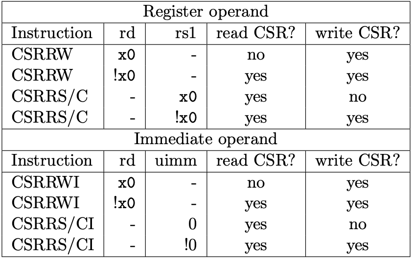

## 权限等级

RISC-V定义了三个权限等级：

| 名称                  | 编码 | 缩写 |
| --------------------- | ---- | ---- |
| 用户级/应用级         | 00   | U    |
| supervisor/操作系统级 | 01   | S    |
| 机器级                | 11   | M    |

另外 `10` 是保留给 Hypervisor 的，Hypervisor 相关的内容还处于草案阶段。

## 控制状态寄存器 — CSR

RISC-V 提供了和内存分离的 12 位地址空间，用于表示各类控制状态寄存器。

RISC-V 的权限等级对其上运行的程序的影响之一在于其不同权限等级下对是否能对各种CSR进行读写。

### CSR 编码规则

- 最高两位代表是否允许读写这一CSR

  | CSR Address[11:10] | 速写权限 |
  | ------------------ | -------- |
  | 11                 | 只读     |
  | 其他               | 读写     |

- 接下来两位 `[9:8]`，代表能访问这一CSR的最低权限等级

各个CSR的详细地址见文档，这里选取部分关键的CSR介绍：

### 部分关键CSR

下面以机器级的CSR为例，其他等级下的CSR也是相似的。

#### `mstatus`


其中各个位的作用：

- MIE：全局机器级中断使能位
- SIE：全局操作系统级中断使能位
- MPIE：当前“陷入”发生前MIE的值
- SPIE：当前“陷入”发生前SIE的值
- MPP：当前“陷入”到机器级前所在的权限等级
- SPP：当前“陷入”到操作系统级发生前所在的权限等级

以上几个位在由 x 等级陷入到 y 等级时，会：

```c
xPIE = xIE;
xIE = 0;
xPP = y;
```

在由调用 `xRET`  指令从x级的处理函数中返回时，会：

```c
xIE = xPIE;
xPIE = 1;
xPP = U; // U = 00, or M if U is not supported
```

#### `mtvec`

`mtvec` 的低2位表示中断发生时进行跳转的策略，其高30位表示中断向量（表）的地址。

若低2位为0，无论是什么种类的中断，都直接跳转到`{高30位,00}`的地址上。

若低2位为10，则中断处理跳转会跳到`{高30位,00} + 4*cause[30:0]`的地址上。

#### `mcause`

最高位标记这是一个中断(1)还是一个异常(0)，其余位标记实际的中断/异常原因。



#### `mip`

标准中只规定了 `mip` 的低16位的用途：


其中的M和S自然代表权限等级，而：

- E代表外部中断
- T代表时钟中断
- S代表软件中断

若对应IP位为1，则说明有这种类型的中断在pending。

#### `mie`


同样是上面的这些规定

对应IE位为1，则说明使能呢这种类型的中断。

#### `mscrach`

用来存一个表示陷入时使用的环境上下文的指针。

按我理解就是存中断处理用的堆栈指针。

#### `mepc`

用于写入中断发生前的pc。

## 相关指令

#### `ECALL`

用于引发`environment-call-from-X-mode exception`。

#### `WFI`

等待中断

#### CSR控制指令

对CSR的操作有读写、置位、复位三种，其操作数又可以是寄存器和立即数两种。



- CSRRW：先将csr内的数据读入rd，再将rs1内的数据写入这个csr
- CSRRS：将csr内的数据读入rd，再将csr中（rs1为1的位置上）的位设置为1
- CSRRC：将csr内的数据读入rd，再将csr中（rs1为1的位置上）的位设置为0
- 对应的I：相当于把前面的rs1的值改为了这个（无符号的）立即数


