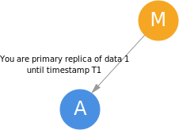
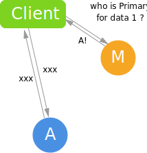

> 在[计算机科学中](https://zh.wikipedia.org/wiki/计算机科学) ， **租约**（Lease）是一项合同，授予其持有人在一定期限内对某些资源的特定权利。 由于它是有时间限制的，因此租约是资源[序列化](https://zh.wikipedia.org/wiki/序列化) [锁](https://zh.wikipedia.org/wiki/锁 (计算机科学))的替代方法。 —— Wikipedia

简单来讲，Lease就是一个告诉某个节点“到这个时间点之前你是这个资源的所有者，到期前系统无论如何都不会把这个资源给别人”的合约。通过这个方法，系统可以保证某个资源在某一时间点上只有一个所有者。

实际应用上，常常使用Lease机制来标识Primary-Secondary系统中的Primary节点是谁。

## 一般工作流程

以Primary-Secondary系统为例：

### 选取Primary

master节点给某个持有某份数据的节点颁发Lease：

注意此时获得Lease的节点不需要[^0]发送回复给Master，因为颁发Lease这件事本来就是“钦定”的，不需要对方的同意，因此Lease的发送只需要单向的通信即可。

如果发送Lease失败，那么只需要重试或者选择其他节点做Master就好了。

### 使用Primary

使用时如[上一章](https://longfangsong.github.io/2020/04/22/Primary-Secondary协议/)所述，先从Master问到Primary在哪里，然后再去和Primary交互。

可见这一过程中完全不需要Master和Primary之间的网络通信。

### Lease到期

Lease到期后，Primary会放弃自己的Primary身份，不会再处理任何需要Primary身份才能进行的请求[^1]。直到下一个Lease被颁发给新的Primary，才能正常提供有关这份data的服务。这略微降低了系统的可用性。

### 检查节点可用性

一般来讲，检查可用性的方案第一个想到的就是基于心跳包的方案，即节点隔一段时间就向Master发送心跳包，Master一段时间内没有收到从某处过来的心跳包就标记这个节点为不可用。

单纯地这么做的问题在于，某一个节点可能因为和Master之间的网络连接不好而被误认为挂掉了，如果这个节点是Secondary还好说，如果是个Primary节点，正在处理某个写请求，而此时Master又选出了新的Primary节点，新Primary节点也在处理另一个写请求……那显然数据完整性就完蛋了。

如果使用Lease机制来保证可用性，即在某个Primary的Lease过期前无论如何都不会剥夺其Primary身份，就不会有问题，Master如果没有收到来自某个Primary的心跳包，也不会立即选择新的Primary，而是等到这个Primary的Lease过期后再选择。这就保证无论何时，一个系统内最多只有某个数据块对应的一个Primary。这显然也是放弃可用性来追求一致性的方案。

## Lease与时钟

从上面的讲解来看，Lease机制对Lease颁发者和使用者之间的时钟速度的一致性有一定的要求，如果颁发者的时钟比使用者的时钟快，那么颁发者认为Lease过期时，使用者可能不这么认为，从而造成一致性问题。

实践中，可以让颁发者稍微“放宽”一点Lease的时间限制，在Lease过期后再过一会再进行对应的操作，不过这段时间也不宜设计地过大，以免使得可用性变得太差。

[^0]: 可以，但没必要.jpg

[^1]: 注意这里Client可能上一秒刚从Master处获知Primary的位置，下一秒请求还没发出来Primary的Lease就过期了，再下一秒，Client发送到Primary的请求就会被Reject。