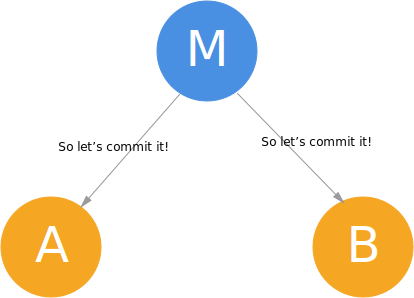

> 经典的分布式数据库模型中，同一个数据库的各个副本运行在不同的节点上，每个副本的数 据要求完全一致。数据库中的操作都是事务(transaction)，一个事务是一系列读、写操作，事务满足 ACID。每个事务的最终状态要么是提交(commit)，要么是失败(abort)。一旦一个事务成功提交，那 么这个事务中所有的写操作中成功，否则所有的写操作都失败。

为了适应这种ACID模型，2PC提供的解决方案是：首先由一个节点（提议者）询问每个其他节点（参与者）是否同意提交某个事务，如果全部同意，则实际提交这个事务，否则拒绝提交这个事务。

## 工作流程

### 成功提交

在任何一个新的事务到来时，master会先将事务开始的相关信息写入日志。

注意要commit的内容在第一次询问时会被cache在各个node上，如果决定了commit，直接做这个cache里的内容就好了，这部分cache也被用于决定后续的事务是否可以被提交。

---

---

---

注意最后的 commit 请求完成后node还需要通知一声master，让master记录此次事务完成。

### 失败

失败提交的可能场景是某些节点上其他事务（可能是上一步留下来还没有完成提交的事务）和待提交的事务有冲突。

---

---

## 异常情况处理

### 宕机

宕机恢复后可以通过日志确定自己处于何种状态。

#### Master

Master宕机后恢复，如果发现自己处于：

- 事务开始了，但还没有作出决定是否commit最后一个事务的状态

  那么重新询问全部节点是否可以commit，然后继续一般流程即可。

- 已经决定是否commit最后一个事务，但还没有实际commit/reject的状态

  简单地从通知所有节点实际进行commit/reject这步开始继续一般流程即可。

#### Node

Node宕机后恢复，如果发现自己处于：

- 已经接到对某个事务的投票请求，但还未投票

  检查并投票，然后继续流程。

- 已经投票，但还没有实际提交

  等待Master发送/重发commit/reject消息即可

### 超时

- Node为某次事务是否commit的投票超时

  Master直接认为它选择了reject这个事务。

- Node某次事务实际提交/拒绝后的确认超时

  不断重试要求其提交，直到Node再次上线并返回确认。

- Node迟迟没有收到Master对某次事务的最终决定

  不断重发自己的投票结果，直到收到决定。

这种不断重试的机制决定了2PC如果不加修改的话，A和P都是很糟糕的，不过相应地也换来了完全的C。

