## BigPicture

将空闲的外存空间组织成多个块组：

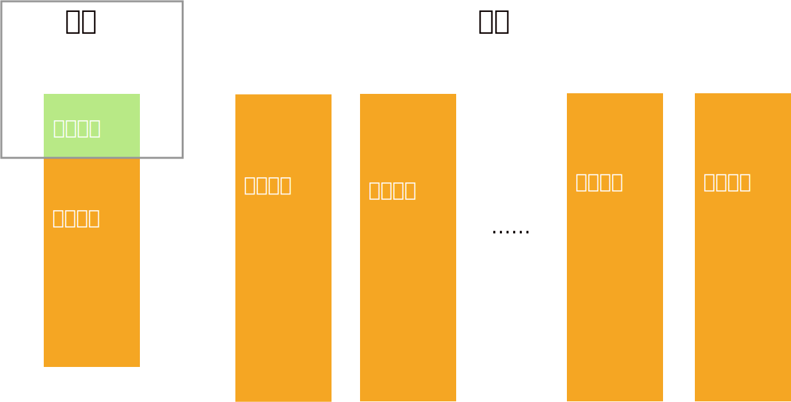

## 空闲块组的结构[^1]

一个空闲块组内有一个元信息块和多个空闲数据块，所有这些数据块都是等大的。

注意这些块没有必要连续。

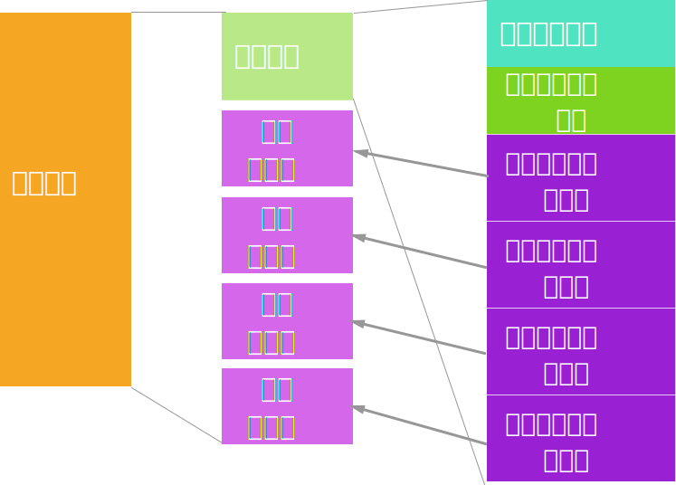

## 块组间的关系

使用“下一空闲块地址”组织成链表：

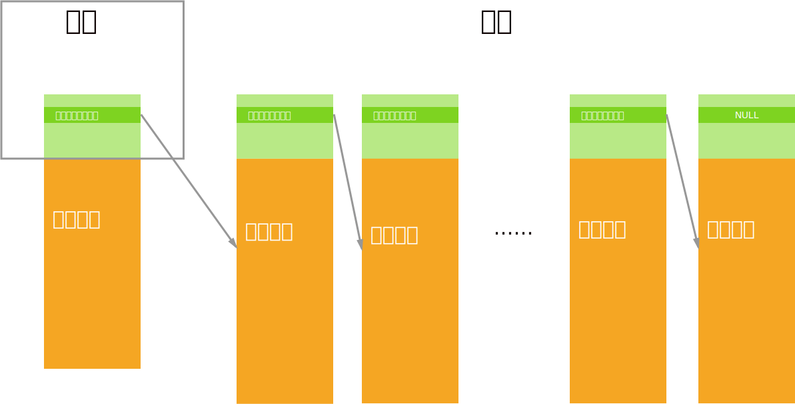

## 分配块

### 内存中的块组有空闲块时

直接将最后一个空闲块分配出去即可：

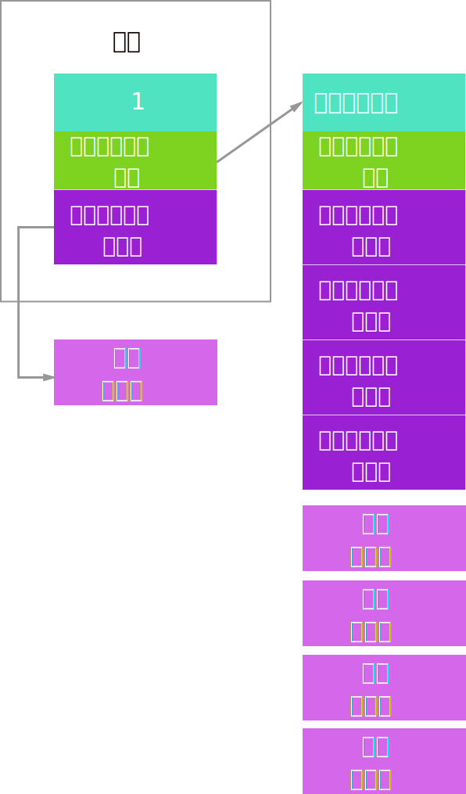

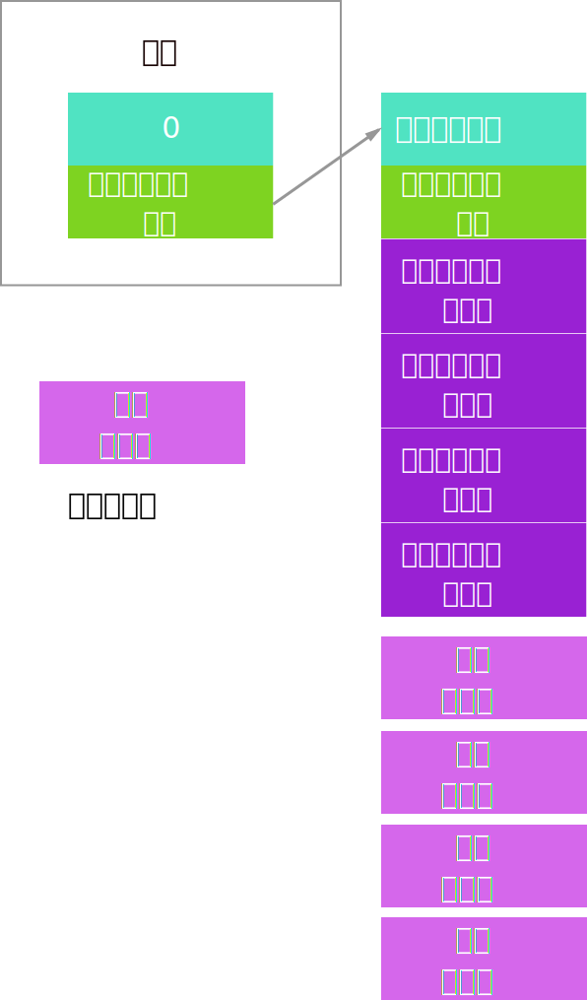

### 内存中的块组无空闲块时

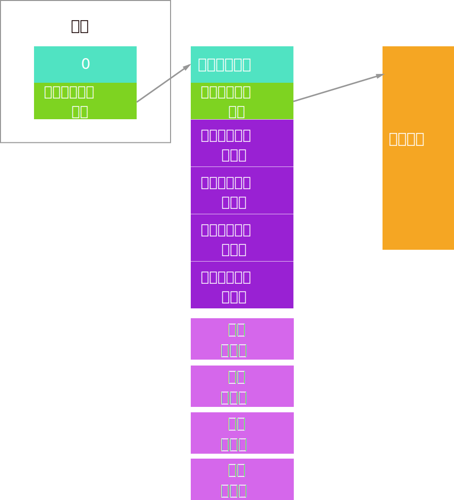

先将下一空闲块组的元数据内容读入内存：

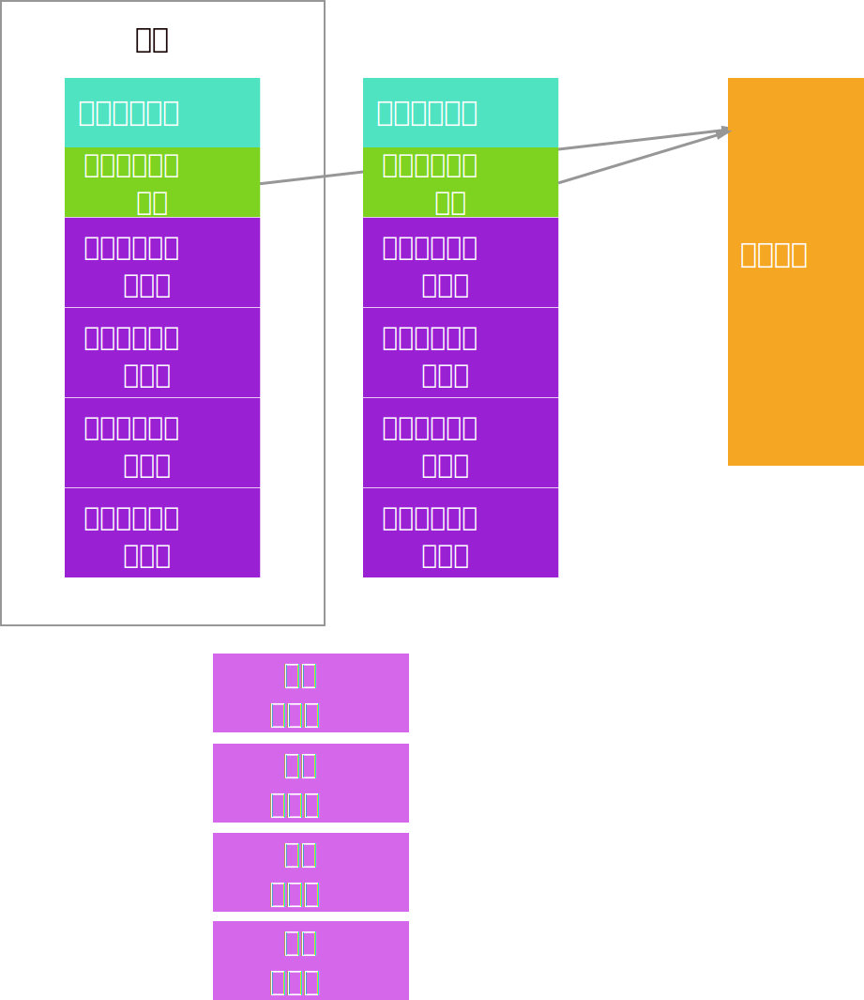

注意“下一空闲块组”的元数据块此时就没用了，可以当作空闲数据块分配出去了。

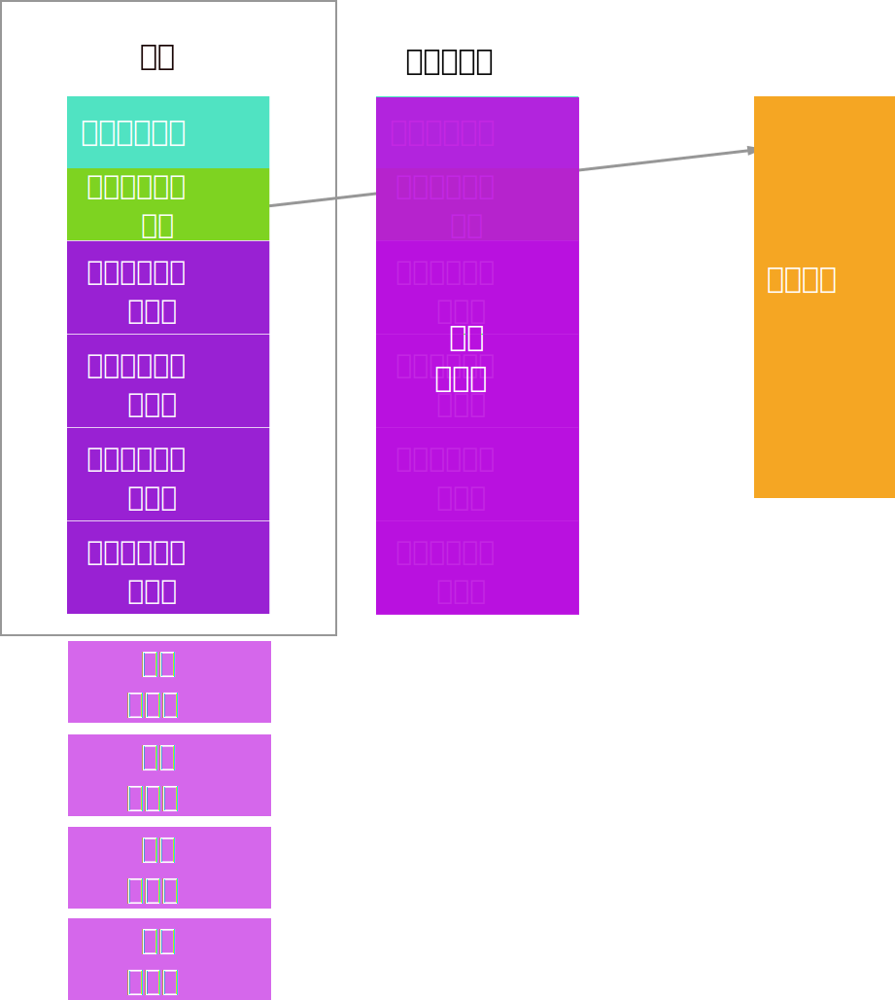

## 回收块

### 内存中的元数据块还没有充满时

这里假设一个数据块只能容纳`空闲数据块数`+`下一空闲块组地址`+4个`组内空闲数据块地址`

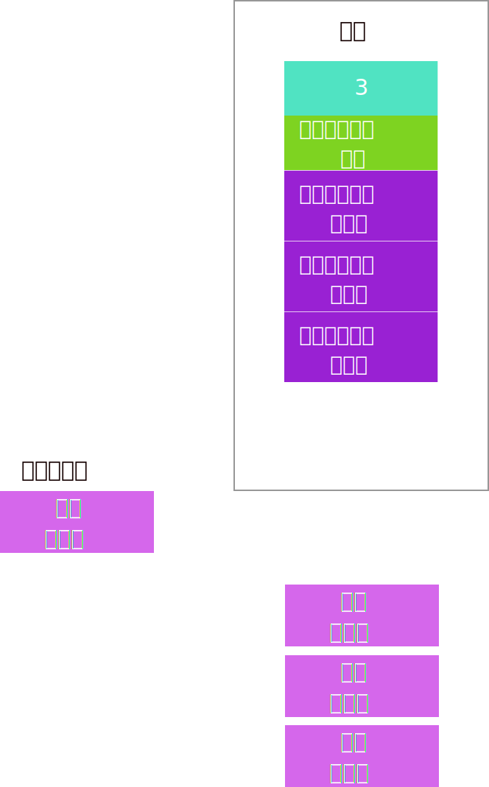

直接把地址放进元数据就好了：

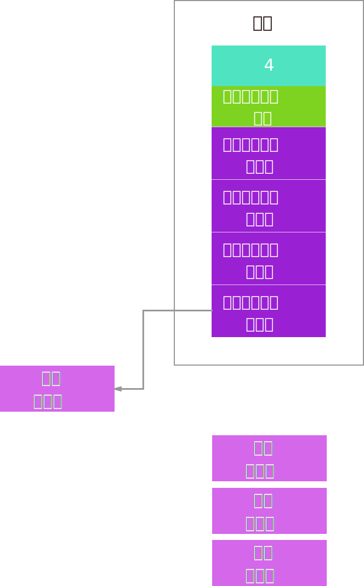

### 内存中的元数据块已经充满时

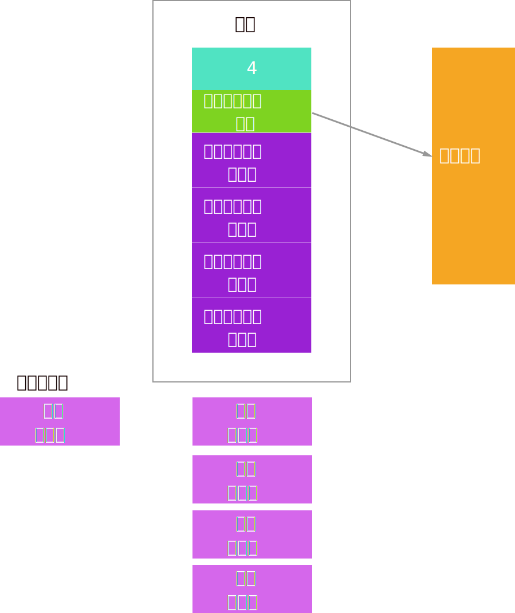

将此时内存中的元数据块的内容写入用户刚刚释放的数据块中：

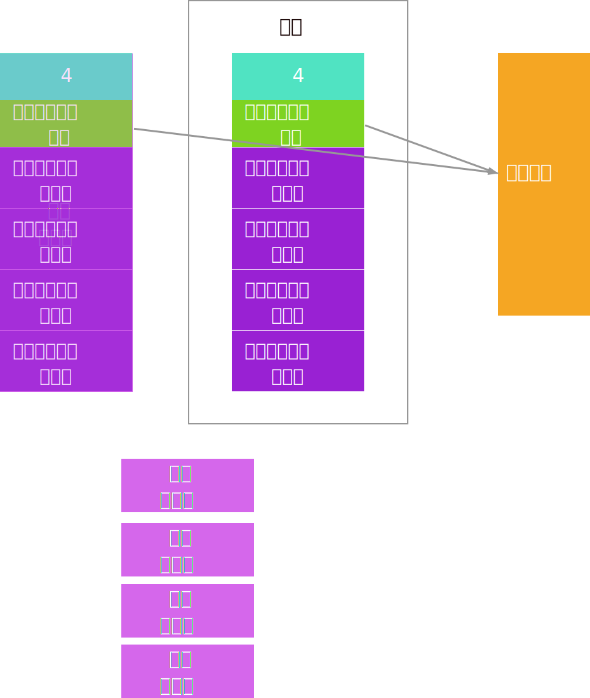

然后清空内存中的元数据（实践上设置空闲数据块数为0即可），将“下一空闲块组地址”指向新回收到的块，就完成了任务：

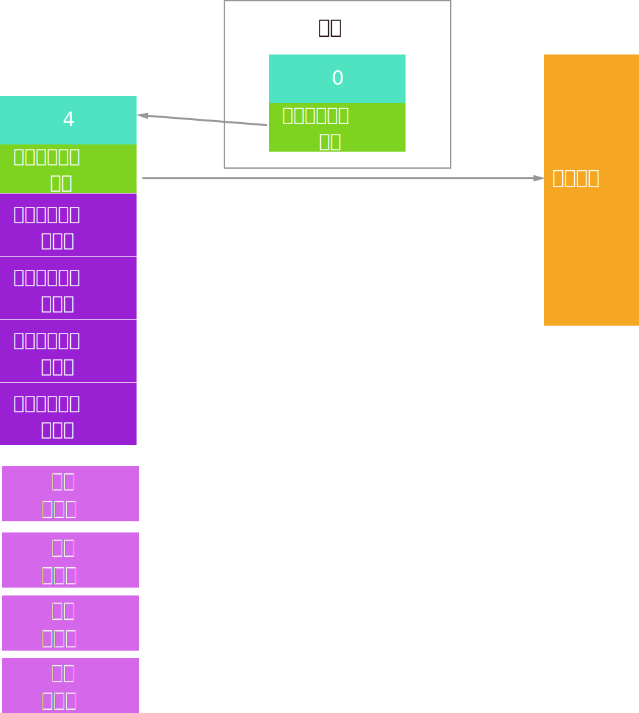

[^1]: 书中将“下一空闲块组地址”和“组内空闲数据块地址”混为一谈，称为`free`栈，同时记录的也不是空闲数据块数，而是`free`栈的长度（等于空闲数据块数+1），个人认为这样不方便理解，故改成这样。

