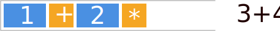
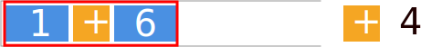
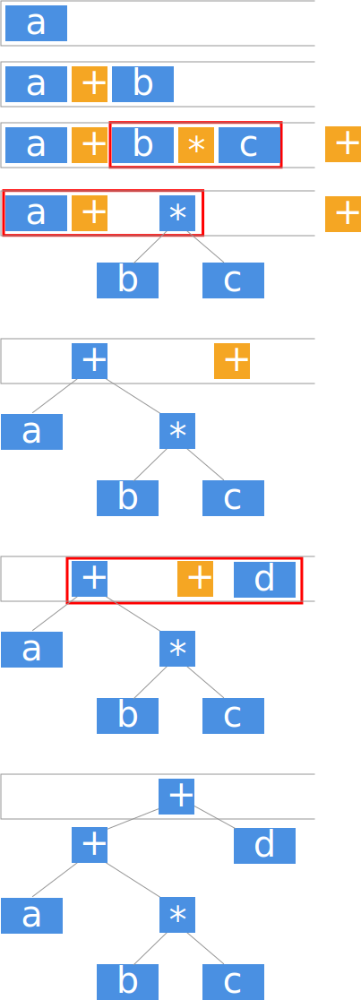

回忆你很可能在大一大二[^1]写过的运用栈进行表达式求值的程序，我们将其简化到只支持加法和乘法，这里给出一个Rust语言的例子（写的比较随意……），太长不看党可以直接跳过看下面的分析：

```rust
    let mut input = String::new();
    stdin().read_to_string(&mut input).unwrap();
    input = input.trim().to_owned();
    let mut current_number = String::new();
    let mut stack = Vec::new();
    for ch in input.chars() {
        match ch {
            '0'..='9' => current_number.push(ch),
            '+' | '*' => {
                if !current_number.is_empty() {
                    stack.push(Token::Value(i32::from_str(&current_number).unwrap()));
                    current_number = String::new();
                }
                let top_op = stack.iter().rev()
                    .find_map(|&it| if let Token::Op(op) = it { Some(op) } else { None });
                if top_op.is_some() {
                    let mut top_op = top_op.unwrap();
                    // 下面的条件实际上是"栈上最后一个操作符优先级大于等于当前读到的操作符"
                    while ch == '+' || top_op == '*' {
                        let op2 = stack.pop().unwrap();
                        let op = stack.pop().unwrap(); // should be equal to top_op
                        let op1 = stack.pop().unwrap();
                        stack.push(Token::Value(eval(op1, op, op2)));
                        let next_top_op = stack.iter().rev()
                            .find_map(|&it| if let Token::Op(op) = it { Some(op) } else { None });
                        if next_top_op.is_none() { break; }
                        top_op = next_top_op.unwrap()
                    }
                }
                stack.push(Token::Op(ch));
            }
            _ => unreachable!()
        }
    }
    if !current_number.is_empty() {
        stack.push(Token::Value(i32::from_str(&current_number).unwrap()));
        current_number.clear();
    }
    let mut top_op = stack.iter().rev()
        .find_map(|&it| if let Token::Op(op) = it { Some(op) } else { None });
    while top_op.is_some() {
        let op2 = stack.pop().unwrap();
        let op = stack.pop().unwrap();
        let op1 = stack.pop().unwrap();
        stack.push(Token::Value(eval(op1, op, op2)));
        top_op = stack.iter().rev()
            .find_map(|&it| if let Token::Op(op) = it { Some(op) } else { None });
    }
		println!("{:?}", stack[0]);
```

我们以表达式$1+2*3+4$的求值来观察这一过程：

1. 输入数字1，压入栈中

   

2. 输入操作符'+'，压入栈中

   

3. 输入数字2，压入栈中

   

4. 输入操作符'*'，压入栈中

   

5. 输入数字3，压入栈中

   

6. 输入操作符'+'，优先级低于栈中最后一个压入的运算符，先对栈中内容求值，再将'+'压入栈中

   - '*'优先级高于'+'，求值

     

     

   - '+'优先级等于'+'，求值
   
     
   
     
   
   - 栈中没有运算符了，压入'+'
   
     
   
7. 看到数字4，压入

   

8. 没有输入了，不断求值直到没有更多运算符

   

   

这里的11就是我们求得得答案。

## 移进和归约

我们看到，我们上面的分析过程中出现了两种操作：

- 移进：将输入的值或者操作符**压入**栈中
- 归约：将输入的值和**栈顶**的某几个值经过计算，变为一般来说更少的几个值，**压回**栈中

我们可以将“值”、“操作符”推广到“文法元素”，得到了文法分析中的移进和归约

- 移进：将输入的某个token**压入**栈中
- 归约：将输入的值和**栈顶**的某几个文法元素经过计算，变为一般来说更少的几个文法元素，**压回**栈中

那么我们就能将上面的例子推广到更一般的，非数字的场景，以文法[^2]：
$$
Expr \rightarrow id | Expr + Expr | Expr * Expr
$$
和表达式$a+b*c+d$为例（图中的所有蓝色节点均代表$Expr$，其中复杂$Expr$已经画为AST的样子）：



通过简单地将上面求值中的数字改为了文法元素（也即AST的节点），我们容易地将表达式求值的方法扩展到了求表达式对应的AST。

## 冲突

在移进-归约分析过程中，可能会遇到某些情况下，有多种可能使用的行为，例如：


此时是否应当将1+2归约为3？这就要等到下一个操作符到来才能决定。

### 移进-归约冲突

当某个输入可以选择与栈中内容结合，进行归约，也可以选择直接压入栈，后续再进行归约时，就说我们遇到了一个移进-归约冲突。

上述的例子就是一个典型的移进-归约冲突。

### 归约-归约冲突

当我们遇到了某个输入与栈中内容结合，其结构符合多个产生式时，可以有多种方式进行归约，这时就说我们遇到了一个归约-归约冲突。

[^1]: 我初三就会写了，你来打我呀（虽然当年写的爆炸丑陋）
[^2]: 这里要注意其实可以说归约时用的产生式是$Expr+ \rightarrow Expr*Expr+|Expr+Expr+$，这样就没有了优先级这个概念，但这样就是个上下文有关文法了。